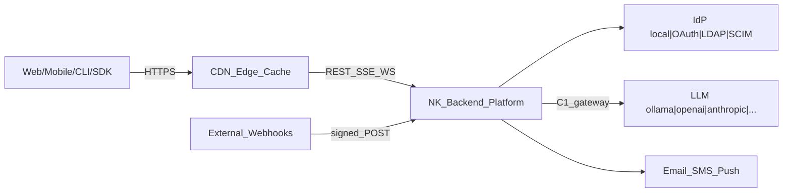
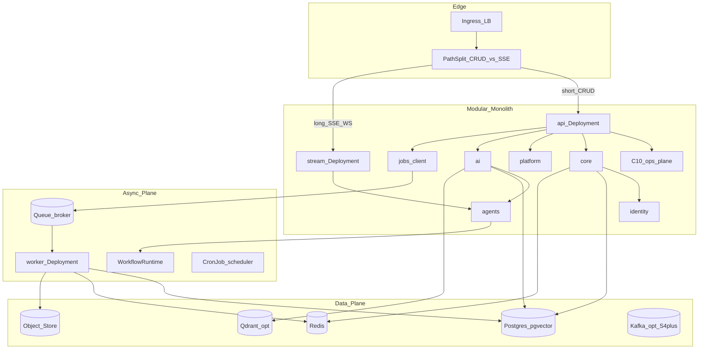
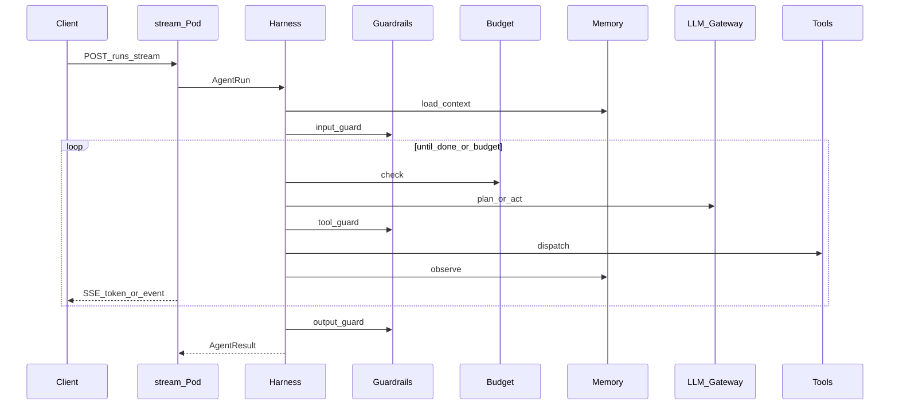
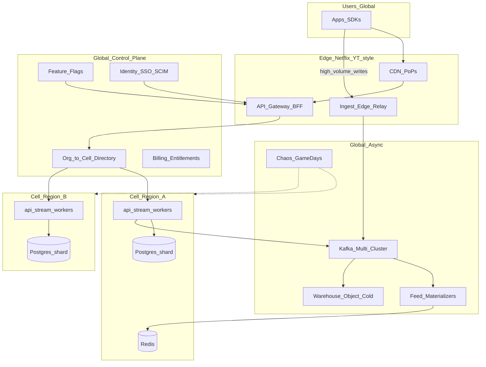

# NK Backend OS — System Design (North Star)

<!-- title: NK Backend System Design · updated: 2026-08-24 · status: ACTIVE — Next.js-for-FastAPI framework SSoT · S0–S6 · OTel/CI-CD · Netflix/YT -->
<!-- one-liner: NK is Next.js for FastAPI — init, ship production defaults, scale without leaving the framework -->
<!-- implementation SSoT: .sisyphus/plans/gold-master-plan.md (phases P0–P9, kill-list, C1–C20) -->
<!-- evidence: temp-full-feature-map.md · TEMP/systemdesign/ · TEMP/<16 repos> · docs/plans/llmchat.md -->
<!-- product framing: framework on top of FastAPI — conventions, CLI, profiles, contracts, paved-road scale -->

## 0. Product Framing — Next.js for FastAPI

**NK Backend OS is a framework on top of FastAPI**, not a pile of boilerplate. Same job Next.js does for React: opinionated structure, zero-config defaults, progressive opt-in, and a paved road from toy app → production → hyperscale — without rewriting.

```text
                    YOUR BUSINESS MODULES
                             │
              ┌──────────────┴──────────────┐
              │     NK BACKEND FRAMEWORK     │
              │  conventions · CLI · profiles│
              │  contracts · OTel · CI gates │
              └──────────────┬──────────────┘
                             │
                         FastAPI
                             │
              Postgres · Redis · Queues · LLM · K8s
```

### 0.1 Parity map (mental model)

| Next.js | NK Backend OS | What you feel |
|---|---|---|
| `npx create-next-app` | `nk init my-app --profile agentic` | one command → runnable app |
| App Router file conventions | module package conventions (§0.3) | put files in the right place → they wire themselves |
| `next.config.js` / `next.config.ts` | `platform.yaml` + BaseConfig (C11) | one config surface for the whole platform |
| `next dev` / `next build` / `next start` | `nk dev` / `nk build` / `nk deploy` | same verbs for local → prod |
| Built-in Image, Font, Script opts | Built-in auth, jobs, outbox, OTel, RAG, agents | batteries included, not DIY |
| Middleware | identity + idempotency + audit middleware | cross-cutting without spaghetti |
| Route Handlers / Server Actions | `router.py` + `service.py` use-cases | thin edge, fat domain |
| Vercel / adapters | compose → Helm → Argo (S0→S6) | deploy presets per stage |
| React ecosystem | provider adapters (DB/IdP/LLM/queue) | swap engines, keep contracts |
| Turbopack / lint defaults | ruff + pyright + profile matrix CI | quality paved-road |

### 0.2 Promise (product contract)

1. **Hours to production skeleton** — `nk init --profile saas` gives API, DB, auth stub, jobs, OTel hooks, tests, Docker, CI.
2. **Same codebase to millions** — earn S0→S6 (§9); never greenfield a “real” rewrite.
3. **Powerful when you need it** — agents, RAG, Temporal, cells, Kafka feeds are **profiles/extras**, not forced deps (`minimal` boots clean — gold #2/#6).
4. **Already configured** — security headers/middleware defaults, readiness gates, outbox, idempotency, structured errors, metric names, Helm values per stage — opinionated defaults, override in `platform.yaml`.
5. **Well maintained** — every adapter has contract tests; every profile is in CI matrix; fake-in-prod and dep-leak are merge blockers; SemVer + changelog; `/build-info` always shows `GIT_SHA`.

### 0.3 Framework conventions (App Router equivalent)

Generated (and hand-grown) apps follow **one module shape**. The framework auto-discovers routers the way Next discovers `page.tsx`:

```text
{project}/
├── platform.yaml              # next.config equivalent
├── pyproject.toml             # extras = optional "use client" weight
├── deploy/                    # compose + helm + otel + ci overlays
├── {project}/
│   ├── core/                  # framework kernel (you rarely edit)
│   ├── web/application.py     # app factory (framework-owned)
│   ├── identity/              # optional module
│   ├── platform/              # files, audit, billing hooks
│   ├── ai/ · agents/          # optional intelligence
│   └── business/modules/      # YOUR code (like app/)
│       └── crm/
│           ├── __init__.py    # exports router + service
│           ├── router.py      # /api/v1/crm/...
│           ├── service.py     # use-cases
│           ├── repository.py  # data access behind Protocol
│           ├── schemas.py     # Pydantic I/O
│           └── tests/
└── tests/contracts/           # framework-enforced adapter suites
```

**Rules (enforced by `nk doctor` + CI):**

- Business logic never imports `openai`, `boto3`, `stripe` directly — only NK protocols.
- New HTTP surface = new module package or new router under an existing module — no random `web/views_*.py`.
- Providers change only via `platform.yaml` / settings, not if/else sprawl.
- Every integration implements the module contract: Interface → Impl → Config → Health → Metrics → Tracing → Errors → Tests.

### 0.4 Batteries included vs progressive disclosure

| Always on (even `minimal`) | Opt-in via profile / extras |
|---|---|
| FastAPI app factory, RFC9457 errors, request-id | Redis, TaskIQ, Kafka, NATS |
| Settings/BaseConfig, structured logging | Identity/RBAC/SCIM |
| `/health` `/ready` `/build-info` | Audit, idempotency, files, webhooks |
| Pytest layout + ruff/pyright | OTel + Prometheus (flags today; default-on for `saas+`) |
| Docker compose | Helm + GitOps overlays |
| — | LLM gateway, embeddings, RAG, agents, MCP |
| — | Fintech ledger, cells, Kafka feeds (S4–S6) |

This is the Next.js trick: **simple path is short; power is one config flag away**, not a different framework.

### 0.5 `platform.yaml` — the `next.config` of NK

Today’s generated file ([platform.yaml](fastapi_template/template/{{cookiecutter.project_name}}/platform.yaml)) is the seed. Target shape the framework maintains:

```yaml
project: my-app
profile: agentic          # minimal | saas | ai-saas | agentic | fintech
framework:
  version: "1.x"          # pinned NK framework / template version
scale:
  stage: S2               # S0..S6 — selects Helm values defaults
providers:
  database: postgres
  cache: redis
  queue: taskiq
  identity: local         # → zitadel | keycloak later
  llm: any_llm            # ollama default locally
  vector: pgvector
  workflow: local         # → temporal at S4+
modules:
  users: true
  agents: true
  rag_traditional: true
  audit: true
  idempotency: true
observability:
  opentelemetry: true
  prometheus: true
  sampling_ratio: 0.1
deploy:
  path_split_stream: true # forced true when agents + stage>=S2
```

`nk doctor` validates this file; `nk deploy` maps `scale.stage` → `deploy/helm/values/prod-s{N}.yaml`.

### 0.6 Why this is “powerful and well maintained”

| Pillar | Mechanism |
|---|---|
| Powerful | C1–C20 capabilities (gold §4): gateway, hybrid RAG, multi-runtime agents, workflows, ops plane |
| Properly configured | S0–S6 K8s + OTel + CI/CD code in §§9–11; security defaults §13 |
| Well maintained | Profile matrix CI, contract tests, kill-list greps, SemVer, ops `/build-info`, wiki INDEX navigation |
| FastAPI-native | We don’t replace FastAPI — we **standardize the 90%** teams re-build every project (like Next around React) |

**One-liner for users and README:**

> **NK is Next.js + Spring Boot for FastAPI — convention routing, production defaults from day one, generate modules instead of copy-paste, scale without leaving the framework.**

### 0.7 Production-grade from day one (reliability baked in)

Like Next.js (sensible defaults) and Spring Boot (starters + auto-config), **every generated app is production-shaped even at S0**. You do not “add reliability later.”

| Built-in (always) | What it replaces (DIY boilerplate) |
|---|---|
| Request ID + correlation in logs/traces | Hand-rolled middleware + logging filters |
| RFC9457 `problem+json` errors | Ad-hoc `{detail: ...}` shapes per project |
| `/health` vs `/ready` (DB/broker warm) | Fake health that lies under load |
| Graceful SIGTERM drain | Dropped in-flight requests on deploy |
| Idempotency-Key on mutations (`saas+`) | Double-charge / double-create bugs |
| Transactional outbox for domain events | “Fire HTTP in request thread” footgun |
| Timeouts + retries on every outbound client | Hanging workers, silent partial failure |
| Structured JSON logs + `trace_id` | Unsearchable printf debugging |
| Settings via env + `platform.yaml` only | Secrets in code / twelve scattered configs |
| Pytest layout + contract hooks | “We’ll test later” |

**Reliability rule:** if a feature is required for production, it is either **on by default** for that profile or **impossible to forget** (`nk doctor` fails CI).

### 0.8 Easy routing — Next.js App Router × Spring `@RestController`

Routing must be **boring and automatic**. Developers declare; the framework mounts.

**Convention (file → URL):**

```text
business/modules/crm/leads/router.py
  @resource(prefix="/leads", tags=["crm"])
  class LeadsRouter:
      @get("/")           → GET  /api/v1/crm/leads
      @get("/{id}")       → GET  /api/v1/crm/leads/{id}
      @post("/", status=201)
      @patch("/{id}")
      @delete("/{id}")
```

**Framework owns:**

- Version prefix `/api/v1` (configurably `/api/v2`)
- Module mount from package discovery (`nk.modules` entry points or `business/modules/*/router.py`)
- OpenAPI tags, operation_id, pagination/filter query schemas
- Authn dependency injected once (`CurrentUser`, `OrgContext`) — like Spring `SecurityContext`
- Tenant `org_id` filter applied in repository layer automatically
- Idempotency + audit hooks on unsafe methods without per-handler copy-paste

**Spring Boot parallel:**

| Spring | NK |
|---|---|
| `@RestController` + `@RequestMapping` | `@resource` + `@get/@post/...` (or APIRouter factory) |
| `@Service` / `@Repository` | `service.py` / `repository.py` auto-wired via DI |
| `@Autowired` / constructor injection | FastAPI `Depends` + NK DI container (C11) |
| Spring Data `JpaRepository` | `Repository[T]` protocol + generated CRUD mixin |
| `@Transactional` | `UnitOfWork` context / `@transactional` |
| `application.yml` profiles | `platform.yaml` + `--profile` |
| Actuator | C10 ops plane (`/health` `/ready` `/build-info` `/ops/*`) |
| Starters (`spring-boot-starter-data-jpa`) | extras (`nk-backend[saas]`, `[agentic]`, `[fintech]`) |

### 0.9 Kill repeated code — framework replaces the 90% copy-paste

Every new FastAPI project reinvents the same pile. **NK owns that pile** so modules stay thin.

```text
YOU WRITE                          FRAMEWORK PROVIDES
─────────                          ──────────────────
domain fields + rules              CRUD router mixin (list/get/create/update/delete)
service use-cases                  pagination (cursor + offset), filtering, sorting
unique business invariants         Problem details, validation error mapping
                                   Org-scoped repository base
                                   Idempotency middleware
                                   Outbox.emit(event)
                                   Job.enqueue(name, payload)
                                   CurrentUser / require_permission("crm.leads.write")
                                   Audit.log(action, resource)
                                   Cache-aside helper (get_or_set)
                                   Rate-limit decorator (per key/org)
                                   Signed webhook verifier
                                   Soft-delete + restored_at conventions
                                   ETag / If-Match optimistic concurrency
                                   SSE/stream response helpers (agentic)
                                   Test client fixtures + factory boy seeds
```

**CRUD in ~15 lines of domain, not 150 of framework:**

```python
# business/modules/crm/leads/service.py
class LeadService(CrudService[Lead]):
    repository: LeadRepository  # injected

    async def create(self, data: LeadCreate, *, user: User, org: Org) -> Lead:
        lead = await super().create(data, user=user, org=org)
        await self.outbox.emit("crm.lead.created", lead.id)
        return lead
```

```python
# business/modules/crm/leads/router.py — mounted automatically
router = crud_router(
    LeadService,
    prefix="/leads",
    schemas=(LeadCreate, LeadUpdate, LeadRead),
    permissions={"write": "crm.leads.write", "read": "crm.leads.read"},
)
# → full OpenAPI + authz + idempotency + audit + tenant scope
```

**`nk generate module crm.leads`** scaffolds the package; you fill schemas + invariants only.

### 0.10 Lightweight power features (real-life, small deps, high leverage)

Opt-in or tiny always-on helpers — **not** a second Kafka cluster:

| Feature | Why it feels like Spring/Next “magic” | Weight |
|---|---|---|
| **Cursor pagination default** | Infinite scroll / mobile APIs without N+1 offset bugs | stdlib + SQL |
| **Idempotency-Key store** | Safe retries from mobile/webhooks (Stripe pattern) | Redis or PG table |
| **Outbox + `emit()`** | Reliable integration events without distributed txs | PG table + relay |
| **Feature flags / kill switches** | Ship dark; disable bad agent tools instantly | config + Redis optional |
| **OrgContext middleware** | Every query tenant-safe without remembering filters | Depends() |
| **Permission decorators** | `@require("orders.refund")` like Spring `@PreAuthorize` | RBAC tables |
| **Soft delete mixin** | Recoverables + audit-friendly | one column + default scope |
| **Optimistic locking (`version`)** | Concurrent edit safety | integer column + 409 |
| **Signed URL uploads** | No multi-GB through API pods | S3/MinIO adapter |
| **Webhook signature helper** | Stripe/GitHub/Razorpay verify in one call | stdlib hmac |
| **Job progress + cancel** | UX for long imports/agents | Redis status keys |
| **Circuit breaker decorator** | Protect DB/LLM when downstream dies | tiny state machine |
| **Rate limit per API key/org** | Abuse protection from day one | Redis token bucket |
| **SSE helper** | Agent/token streams without hand-rolled protocols | FastAPI StreamingResponse |
| **OpenAPI → typed client** | `nk generate client` for Next.js/frontend | openapi-generator optional |
| **Seed / factory CLI** | `nk seed demo` for local + e2e | fixtures module |
| **Config hot-patch (dev)** | dsh-style overlay without rebuild | platform.yaml patches |
| **LLM degrade mode** | Provider 503 → cached/fallback answer; API stays up | gateway flag |

These stay **extras or thin mixins** so `minimal` remains light; `saas`/`agentic` turn the set on via profile.

### 0.11 Developer experience loop (Spring Boot feel)

```text
nk init shop --profile saas
nk generate module catalog.products
# edit schemas + one invariant in service
nk dev
# OpenAPI at /api/docs already documents routes
# /ready fails until Postgres is up — correct
# POST with Idempotency-Key is safe to retry
nk test && nk deploy staging
```

No hand-written: JWT plumbing, error envelope, pagination, tenant filter, docker health, CI lint matrix, OTel bootstrap.

---

## 1. Purpose & Non-Goals

**Purpose:** master architecture for the **NK Backend Framework** (Next.js-for-FastAPI): thesis, conventions, C4, flows, tenancy, reliability, **0→millions Kubernetes stages**, telemetry, DevOps/CI-CD, security, packs — readable without llmchat.md.

**Non-goals:** not a raw FastAPI tutorial; no per-repo feature catalogs (feature map); no phase task checklists (gold-master only); no Day-1 microservices mesh; no inventing infra we integrate.

**Thesis (locked):** cookiecutter/`nk` factory → **modular monolith framework** → `Industry packs → Product modules → Platform core → Infra adapters`. We own contracts/harness/policies/DX; we integrate Postgres, Redis, S3, Kafka, Temporal, IdP, vector DBs, LLM gateways. AI is first-class optional extras.

**Locked decisions:** gold-master §1. Never re-litigated here.

---

## 2. C4 — Context



Identity, models, notifications = adapters behind owned interfaces. Business code never imports vendor SDKs directly.

---

## 3. C4 — Container (runtime topology)



**Path-split (Zulip `zerver/tornado/`):** SSE/WS agent streams never share the CRUD Deployment. Ingress routes `/api/v1/runs/*/stream`, `/ws/*` → `stream` Service; everything else → `api` Service. A slow model stream must not starve CRUD.

---

## 4. C4 — Component (packages)

| Layer | Package | Owns | Gold |
|---|---|---|---|
| Kernel | `core/` | BaseConfig(C11), DI, RFC9457, IDs/time, CloudEvents, feature flags | C11 |
| API | `web/` `api/` | `/api/v1/{module}`, middleware, SSE/WS, MCP mount, agent-protocol | C9,C10,C20 |
| Identity | `identity/` | authn/authz/orgs/keys; local→OAuth→LDAP→SCIM | C12 |
| Data | `data/` | Repository+UoW; SA+pgvector / Beanie | contracts |
| Async | `jobs/` `messaging/` | enqueue, retry, DLQ, rate-limit, breaker, outbox | C19 |
| Workflows | `workflows/` | local graph→Temporal; HITL interrupts | C15 |
| AI | `ai/` | any-llm gateway, fastembed, hybrid RAG, ingestion | C1–C4,C16,C17 |
| Agents | `agents/` | NK harness, tools/MCP, skills, budgets, guardrails, memory | C5–C8,C14 |
| Platform | `platform/` | files, audit, idempotency, billing hooks, notifications | C13 |
| Ops | `operations/` | OTel, usage/cost, admin routes, build info | C10,C18 |
| Industry | `industry/fintech/` | ledger, maker-checker, case workflow | P8 |
| Deploy | `deploy/` | compose overlays, Helm chart, Kustomize bases, GitOps apps | — |
| DX | `cli/` generators | `nk init/dev/doctor/generate/migrate/deploy` | P9 |

Internal style = GitLab monolith-with-services (`app/services/*`): thin routers, fat use-case services, extractable seams.

---

## 5. Capability Map

Capabilities C1–C20 live only in gold-master §4. Mapping: C11→kernel · C9/C10/C20→API+ops · C12→identity · C19→async · C15→workflows · C1–C4/C16–C17→AI · C5–C8/C14→agents · C13→platform · C18→ops.

---

## 6. Core Flows

### 6.1 CRUD

```text
client → CDN? → Ingress → api Pod → request-id → authn → authz
  → service → Repository(UoW) → commit(+outbox) → 200|problem+json
  → OTel span end → audit (if state-changing)
```

### 6.2 Background job

```text
API enqueue(job, idempotency_key) → broker → worker
  → load idempotency → execute(timeout, retry)
  → success: ack + outbox event | fail: backoff ×N → DLQ + alert
```

Never silent drop (Zulip `queue_processors` discipline).

### 6.3 Agent run



Owned IP: **Harness → Skills → ToolRegistry → PolicyEngine → RetrievalEngine → ModelRouter**.

### 6.4 RAG query

```text
query → dense(pgvector) ⊕ sparse(FTS/BM25) → RRF → rerank → cite → generate
```

### 6.5 Ingestion

```text
source → parse → chunk → embed(dense+sparse) → upsert → indexed-event | DLQ
```

---

## 7. Tenancy, AuthZ, Audit

**Tenancy modes (config switch, day-one):**

| Mode | When | Mechanism |
|---|---|---|
| shared schema + `org_id` | default SaaS | row RLS / forced filter in Repository |
| schema-per-tenant | enterprise | search_path / schema migrate per org |
| DB-per-tenant | regulated / white-label | connection router by org mapping |

Hierarchy: `org → project → resource` (Airbyte/Zulip). Every job/tool/query carries tenant context from identity middleware.

**AuthZ:** `(principal, action, resource)` pure policy; groups gate models/tools/datasets.

**Audit:** *state-changing ⟺ logged* (generalized dsh invariant). Path include/exclude. Fintech: maker-checker audit before transition.

---

## 8. Reliability & Scale Ladder

| Concern | Mechanism |
|---|---|
| Durable side-effects | transactional outbox → relay |
| Exactly-once intent | Idempotency-Key + job dedupe |
| Failure isolation | timeout+retry mandatory per integration |
| Poison | DLQ + alert + `nk jobs replay` |
| Backpressure | admission control on agent runs; HPA on lag |
| Long-running | Workflow checkpoints → Temporal at S4+ |
| Cache | Redis = cache/rate/session only; Postgres = truth |
| Lifecycle | readiness after pool warmup; SIGTERM drain; auth'd quitquitquit |

**Earn each scale stage — never skip.**

---

## 9. Scale Stages S0→S6 (0 to millions) — Kubernetes Master Plan

Each stage has: **load band**, **topology**, **K8s objects**, **data**, **telemetry**, **CI/CD gates**, **exit criteria** to advance. Profiles map onto stages; a `minimal` app can live forever at S0–S1.

### Stage legend

```text
S0  Laptop / single box          ~0–100 RPS, <1k MAU
S1  Single-cluster starter       ~100–1k RPS, <50k MAU
S2  HA modular monolith          ~1k–5k RPS, <500k MAU
S3  Workload-split + replicas    ~5k–20k RPS, <2M MAU
S4  Data+async scale-out         ~20k–80k RPS, <10M MAU
S5  Cell / multi-region          ~80k–300k RPS, <50M MAU
S6  Hyperscale (Netflix/YT class)~300k+ RPS, 50M+ MAU
```

RPS bands are **order-of-magnitude guides**, not SLAs. Advance on measured bottlenecks + SLO burn, not vanity.

---

### S0 — Local zero-to-one (compose only)

**Topology:** one `api` process (+ optional worker in-process for tests). Postgres (+ Redis if saas).

**Config:** `docker compose up`; `nk dev`; OTel optional to local collector.

**K8s:** none required. Optional kind/k3d single-node for chart smoke.

**Exit → S1:** need shared staging, >1 replica, or external clients.

---

### S1 — Single-cluster starter

**Topology (one namespace `nk-staging` or `nk-prod`):**

```text
Ingress → api (replicas=2) → Postgres (managed or StatefulSet)
                          → Redis (optional)
                          → worker (replicas=1)
```

**K8s objects (generated `deploy/helm/nk-backend`):**

| Object | Spec highlights |
|---|---|
| Deployment/api | 2 pods, requests/limits, PDB minAvailable=1 |
| Deployment/worker | 1 pod, same image, command=`nk worker` |
| Service/api | ClusterIP |
| Ingress | TLS, path `/` → api |
| ConfigMap + Secret | platform.yaml overlay + provider keys |
| HPA | CPU 70% target, min 2 max 6 (api) |
| NetworkPolicy | egress allowlist DB/Redis/IdP/LLM |
| ServiceAccount + IRSA/Workload Identity | no static cloud keys in pods |

**Data:** single Postgres primary; daily backups; Redis ephemeral OK.

**Telemetry:** OTLP → collector DaemonSet/sidecar → Tempo/Jaeger + Prometheus + Loki; `/metrics` scraped; RED dashboards.

**CI/CD:** build → test → push image → Helm upgrade staging → smoke → manual promote prod.

**Exit → S2:** need multi-AZ HA, zero-downtime deploys proven, p99 SLO under load test.

---

### S2 — HA modular monolith (production default for most SaaS)

**Topology:**

```text
Ingress (multi-AZ) → api×N (spread) → Postgres primary+sync replica (managed)
                   → stream×K (path-split) → Redis HA
                   → worker×M             → S3
                   → migrate Job (pre-sync)
```

**K8s adds:**

- **TopologySpreadConstraints** / podAntiAffinity across zones
- **PDB** api + stream + worker
- **separate Deployment/stream** for SSE/WS (Zulip path-split)
- **Helm hooks / Argo PreSync Job** for Alembic migrate (never migrate in app startup in prod)
- **ExternalSecrets** / sealed-secrets
- **VPA or right-sized requests** from load-test baselines
- **PodDisruptionBudget + RollingUpdate** maxUnavailable=0 or maxSurge=25%

**Data:** managed Postgres multi-AZ, PITR; Redis Sentinel/Cluster or managed; object storage versioned + lifecycle.

**Telemetry:** error budget SLO burn alerts; queue lag; saturation; continuous profiling optional.

**CI/CD:** GitOps (Argo CD / Flux); canary or blue/green via Flagger/Argo Rollouts; auto-rollback on SLO burn.

**Exit → S3:** CRUD p99 or stream saturation under peak; need independent scale of ingest/agent/worker fleets.

---

### S3 — Workload split (still one codebase, many Deployments)

**Same image, different commands/probes** — modular monolith, not microservices.

```text
api          — REST CRUD
stream       — SSE/WS / agent-protocol streams
worker-default
worker-ingest  — RAG indexing / heavy IO
worker-agent   — tool-heavy agent steps (sandbox sidecars)
scheduler      — CronJobs
relay-outbox   — outbox publisher
```

**K8s:** per-workload HPA (CPU / custom: queue depth via KEDA); PriorityClasses; resource Quotas per namespace; optional dedicated node pools (CPU vs memory vs GPU for local embed/vLLM).

**Ingress:** path → Service mapping locked in Helm values:

```yaml
routes:
  - path: /api/v1/runs
    pathType: Prefix
    service: stream
  - path: /ws
    pathType: Prefix
    service: stream
  - path: /
    pathType: Prefix
    service: api
```

**Exit → S4:** DB CPU/IO or broker lag is the bottleneck; need partitioning, read replicas for reads, Kafka for fan-out.

---

### S4 — Data & async scale-out

**Topology adds:**

```text
                    ┌─ read replicas (ORM read session)
api/stream ─────────┤
                    └─ primary (writes only)
outbox relay → Kafka (or NATS JetStream) → consumer groups (workers)
pgvector | Qdrant cluster for heavy vector QPS
CDN caching for public GETs + signed URLs for files
```

**K8s / infra:**

- Postgres: read replicas + PgBouncer / managed pooler; connection budgets per Deployment
- Optional **Qdrant** StatefulSet or managed vector
- **Kafka** (Strimzi) when fan-out > Redis list queues can carry
- **KEDA** ScaledObjects on consumer lag
- **Temporal** workers Deployment when multi-day durable workflows appear (Airbyte pattern)
- **Sandbox Jobs/Pods** for untrusted tool exec (E2B/Modal pattern or in-cluster Job with NetworkPolicy deny-all)

**Data patterns:** CQRS-lite (read models for hot lists); partition large tenant tables by `org_id` hash when single-table bloat hits; object storage multipart + CDN.

**Exit → S5:** single-region blast radius unacceptable; residency/latency needs multi-region; org-level isolation for top tenants.

---

### S5 — Cells / multi-region (Sentry-style)

**Control plane vs data plane:**

```text
Global control: identity, billing, org→cell directory, feature flags
Cell N: api+stream+workers+Postgres(+Redis) owning a shard of orgs
Edge: thin routing gateway maps org → cell (Sentry apigw idea)
```

**K8s:** one cluster per region (or per cell); **cluster federation / GitOps app-of-apps**; global Traffic Manager / geo-DNS; **cell Helm release** parameterized by `cell_id`.

**Tenancy:** sticky org→cell mapping table in control DB; migrations are cell-local; cross-cell only via async events.

**DR:** RPO/RTO targets per profile (fintech stricter); failover runbooks; backup restore drills quarterly.

**Exit → S6:** need edge compute, massive fan-out media, or global event bus at internet scale.

---

### S6 — Hyperscale (Netflix / YouTube class) — master target topology

Still **progressive** — adopt only what measured need requires. NK stays the application framework; hyperscale is topology + data plane. Goal: same `nk` contracts power a YouTube-class read path and a Netflix-class resilience posture without a rewrite.



| Pattern | Netflix / YouTube analogue | NK application |
|---|---|---|
| Edge + CDN | Open Connect / YouTube edge cache | signed media, public GETs, BFF cache keys by org+route |
| API gateway / BFF | Zuul/Edge / mobile BFF | path-split + org→cell route; no business logic in gateway |
| Event-sourced feeds | recommendation/timeline pipelines | outbox → Kafka → materializers → Redis/timeline store |
| Hot/cold | EVCache + data warehouse | Redis hot; Postgres OLTP; Parquet/warehouse for analytics (C18 rollups) |
| Ingest edge | telemetry / upload relays | Sentry Relay-style Deployment when write QPS melts api |
| Chaos + game days | FIT / chaos monkeys | Litmus workflows: kill worker, partition cell, region evacuate |
| Multi-cluster GitOps | paved road clusters | Argo app-of-apps per cell; no snowflake |
| FinOps | cost per title/stream | per-org token/cost (C18) → capacity + GPU pool budgets |

**S6 platform.yaml hyperscale flags (earned, off by default):**

```yaml
# platform.yaml — only valid when scale.stage >= S5
scale:
  stage: S6
  cells:
    enabled: true
    routing: org_directory
  edge:
    ingest_relay: true
    cdn: cloudflare  # | cloudfront | fastly
  async:
    bus: kafka
    feed_materializers: true
  resilience:
    chaos_suite: true
    multi_region_dr: true
```

**Non-goals at S6:** don't rewrite business modules; extract **Deployments/Services** along existing package seams (`agents`, `ingest`, `billing`) only when a cell's HPA ceiling is hit.

---

### Stage → profile → Helm values matrix

| Stage | Typical profile | Helm values sketch |
|---|---|---|
| S0 | minimal | compose only |
| S1 | saas | `api.replicas=2`, `worker.replicas=1`, managed PG |
| S2 | saas/ai-saas | `stream.enabled=true`, multi-AZ, Rollouts |
| S3 | agentic | KEDA workers, sandbox pool, path-split required |
| S4 | agentic/fintech | Kafka, read replicas, Temporal, Qdrant |
| S5 | enterprise/fintech | cells, multi-region, org directory |
| S6 | hyperscale pack | edge ingest, feed materializers, chaos suite |

---

## 10. Telemetry — Production Observability (code-level master)

### 10.1 Principles

1. **OpenTelemetry is the only instrumentation API** (template `web/lifespan.py` when `otlp_enabled`). Vendors = exporters only.
2. Traces + metrics + logs correlated by `trace_id`; profiles optional S2+.
3. RED + USE + AI cost/token metrics (C18 + C4 dual-window).
4. Cardinality: route **templates**, not raw URLs; aggregate `org_id` offline.

### 10.2 Local stack (already shippable)

Extend existing [`deploy/docker-compose.otlp.yml`](fastapi_template/template/{{cookiecutter.project_name}}/deploy/docker-compose.otlp.yml) (Grafana `otel-lgtm` on `:4317`/`:3000`). App env:

```yaml
# docker-compose overlay — generated
services:
  api:
    environment:
      {{PROJECT}}_OPENTELEMETRY_ENDPOINT: "http://otel-collector:4317"
      OTEL_SERVICE_NAME: "{{project}}-api"
      OTEL_RESOURCE_ATTRIBUTES: "deployment.environment=dev,service.version=${GIT_SHA}"
  worker:
    environment:
      {{PROJECT}}_OPENTELEMETRY_ENDPOINT: "http://otel-collector:4317"
      OTEL_SERVICE_NAME: "{{project}}-worker"
```

### 10.3 Collector config (K8s ConfigMap — target artifact `deploy/otel/collector-config.yaml`)

```yaml
receivers:
  otlp:
    protocols:
      grpc:
        endpoint: 0.0.0.0:4317
      http:
        endpoint: 0.0.0.0:4318
  prometheus:
    config:
      scrape_configs:
        - job_name: nk-api
          kubernetes_sd_configs:
            - role: pod
          relabel_configs:
            - source_labels: [__meta_kubernetes_pod_label_app]
              regex: nk-api|nk-stream|nk-worker
              action: keep
processors:
  batch:
    timeout: 5s
  memory_limiter:
    check_interval: 2s
    limit_mib: 512
  attributes:
    actions:
      - key: k8s.cluster.name
        value: ${CLUSTER_NAME}
        action: upsert
  filter/drop_health:
    spans:
      exclude:
        match_type: regexp
        attributes:
          - key: http.route
            value: "/health|/ready|/metrics"
exporters:
  otlp/tempo:
    endpoint: tempo.observability:4317
    tls: { insecure: false }
  prometheusremotewrite:
    endpoint: https://mimir.observability/api/v1/push
  loki:
    endpoint: https://loki.observability/loki/api/v1/push
service:
  pipelines:
    traces: { receivers: [otlp], processors: [memory_limiter, filter/drop_health, batch], exporters: [otlp/tempo] }
    metrics: { receivers: [otlp, prometheus], processors: [memory_limiter, batch], exporters: [prometheusremotewrite] }
    logs: { receivers: [otlp], processors: [memory_limiter, batch], exporters: [loki] }
```

### 10.4 App metric names (owned — implement in `operations/telemetry`)

```text
nk_http_requests_total{route,method,status}
nk_http_request_duration_seconds{route,method}
nk_queue_lag_seconds{queue}
nk_dlq_messages{queue}
nk_db_pool_checked_out
nk_agent_runs_total{agent_id,status}
nk_agent_first_token_seconds{agent_id}
nk_llm_tokens_total{model,direction}      # in|out
nk_llm_cost_usd_total{model,org_id}       # aggregated scrape, not per-span
nk_rag_retrieval_seconds{mode}
nk_guardrail_tripwires_total{layer}       # input|tool|output
```

### 10.5 PrometheusRule (SLO burn — `deploy/helm/templates/prometheusrule.yaml`)

```yaml
apiVersion: monitoring.coreos.com/v1
kind: PrometheusRule
metadata:
  name: nk-slo
spec:
  groups:
    - name: nk.slo
      rules:
        - alert: NKAPIHighErrorRate
          expr: |
            sum(rate(nk_http_requests_total{status=~"5.."}[5m]))
              /
            sum(rate(nk_http_requests_total[5m])) > 0.01
          for: 5m
          labels: { severity: page }
          annotations:
            summary: "API 5xx > 1% for 5m"
        - alert: NKQueueLag
          expr: histogram_quantile(0.95, sum(rate(nk_queue_lag_seconds_bucket[5m])) by (le, queue)) > 120
          for: 5m
          labels: { severity: page }
        - alert: NKDLQGrowth
          expr: increase(nk_dlq_messages[15m]) > 0
          labels: { severity: ticket }
        - alert: NKAgentFirstTokenSlow
          expr: histogram_quantile(0.95, sum(rate(nk_agent_first_token_seconds_bucket[5m])) by (le)) > 2
          for: 10m
          labels: { severity: ticket }
        # Multi-window burn (Google SRE): fast 1h @ 14.4× + slow 6h @ 6× of 30d budget
        - alert: NKAPIErrorBudgetBurnFast
          expr: |
            (
              sum(rate(nk_http_requests_total{status=~"5.."}[1h]))
                / sum(rate(nk_http_requests_total[1h]))
            ) > (14.4 * (1 - 0.999))
          for: 2m
          labels: { severity: page }
```

### 10.6 Agent span contract

```text
AgentRun span (run_id, thread_id, org_id, agent_id)
 ├── LLM (model, provider, tokens_in/out, cost_usd)
 ├── Tool (name, ok|error_class, sandbox)
 ├── Retrieval (mode, topk, fusion_ms, rerank_ms)
 └── Guardrail (layer, tripwire_reason?)
```

Langfuse/Phoenix = optional OTLP consumers — never `minimal` deps.

### 10.7 SLOs

```text
Availability API: 99.9% (S2) · 99.95% (S4+ fintech)
API CRUD p99: < 300ms (excl stream)
Stream first-token p95: < 2s
Queue lag p95: < 30s; page > 120s for 5m
DLQ growth: 0 sustained
RAG retrieval p95: < 250ms excl rerank
Ingestion lag p95: < 5m
```

### 10.8 Ops plane (C10)

`/health` (liveness) · `/ready` (DB+broker warm) · `/build-info` (`GIT_SHA`, `BUILD_DATE`) · auth'd `/ops/log-level` · `/ops/quitquitquit`.

---

## 11. DevOps, CI/CD & Supply Chain (code-level master)

### 11.1 Pipeline

```mermaid
flowchart LR
  PR[PR] --> LINT[ruff_pyright]
  LINT --> UNIT[pytest]
  UNIT --> MATRIX[profile_matrix]
  MATRIX --> CONTRACT[contracts]
  CONTRACT --> BUILD[build_sign_sbom]
  BUILD --> STAGING[helm_argo_staging]
  STAGING --> SMOKE[e2e_smoke]
  SMOKE --> CANARY[rollouts_canary_prod]
  CANARY --> SLO[slo_burn_gate]
  SLO --> STABLE[stable]
```



**Non-negotiable gates:** profile matrix (`minimal|saas|ai-saas|agentic`); grep no `FakeChatModel` outside `tests/_fakes.py`; minimal lockfile zero `langchain|fastembed|any_llm`.

### 11.2 Exists today (extend)

| Artifact | Path |
|---|---|
| PR tests | [`.github/workflows/tests.yml`](fastapi_template/template/{{cookiecutter.project_name}}/.github/workflows/tests.yml) |
| GitLab CI | [`.gitlab-ci.yml`](fastapi_template/template/{{cookiecutter.project_name}}/.gitlab-ci.yml) |
| Pre-commit | [`.pre-commit-config.yaml`](fastapi_template/template/{{cookiecutter.project_name}}/.pre-commit-config.yaml) |
| OTel compose | [`deploy/docker-compose.otlp.yml`](fastapi_template/template/{{cookiecutter.project_name}}/deploy/docker-compose.otlp.yml) |
| Flags | [`platform.yaml`](fastapi_template/template/{{cookiecutter.project_name}}/platform.yaml) `observability.*` |

### 11.3 Target workflow — CI (`.github/workflows/ci.yml`)

```yaml
name: ci
on:
  pull_request:
  push:
    branches: [main]
jobs:
  lint-test:
    runs-on: ubuntu-latest
    steps:
      - uses: actions/checkout@v4
      - uses: astral-sh/setup-uv@v6
      - uses: actions/setup-python@v6
        with: { python-version: "3.12" }
      - run: uv sync --locked
      - run: uv run ruff check . && uv run ruff format --check .
      - run: uv run pyright
      - run: |
          ! rg -n "FakeChatModel|FakeEmbeddingProvider" --glob '!tests/_fakes.py' \
            || (echo "fake-in-prod" && exit 1)
      - run: docker compose run --rm api pytest -q
  profile-matrix:
    needs: lint-test
    strategy:
      matrix:
        profile: [minimal, saas, ai-saas, agentic]
    runs-on: ubuntu-latest
    steps:
      - uses: actions/checkout@v4
      - uses: astral-sh/setup-uv@v6
      - name: Generate + test profile
        run: |
          uv run python -m fastapi_template --quiet --profile ${{ matrix.profile }} -n "mat_${{ matrix.profile }}"
          cd "mat_${{ matrix.profile }}"
          uv sync --locked
          if [ "${{ matrix.profile }}" = "minimal" ]; then
            ! rg -n "langchain|fastembed|any_llm" uv.lock || exit 1
          fi
          uv run pytest -q
  build-sign:
    if: github.ref == 'refs/heads/main'
    needs: [lint-test, profile-matrix]
    permissions:
      id-token: write
      contents: read
      packages: write
    runs-on: ubuntu-latest
    steps:
      - uses: actions/checkout@v4
      - uses: docker/setup-buildx-action@v3
      - uses: docker/login-action@v3
        with:
          registry: ghcr.io
          username: ${{ github.actor }}
          password: ${{ secrets.GITHUB_TOKEN }}
      - name: Build
        run: |
          IMAGE=ghcr.io/${{ github.repository }}:${{ github.sha }}
          docker build -t "$IMAGE" \
            --build-arg GIT_SHA=${{ github.sha }} \
            --build-arg BUILD_DATE=$(date -u +%Y-%m-%dT%H:%M:%SZ) .
          docker push "$IMAGE"
          echo "IMAGE=$IMAGE" >> "$GITHUB_ENV"
      - name: SBOM + scan + cosign
        run: |
          syft "$IMAGE" -o spdx-json > sbom.spdx.json
          trivy image --exit-code 1 --severity CRITICAL "$IMAGE"
          cosign sign --yes "$IMAGE"
          cosign attach sbom --sbom sbom.spdx.json "$IMAGE"
```

### 11.4 Target workflow — deploy staging + canary prod

```yaml
# .github/workflows/deploy.yml
name: deploy
on:
  workflow_run:
    workflows: [ci]
    types: [completed]
    branches: [main]
jobs:
  staging:
    if: ${{ github.event.workflow_run.conclusion == 'success' }}
    runs-on: ubuntu-latest
    permissions: { id-token: write, contents: read }
    steps:
      - uses: actions/checkout@v4
      - name: OIDC → cloud → kubecontext
        run: # aws-actions/amazon-eks-update-kubeconfig OR az/gcloud equivalent
          echo "configure OIDC to staging cluster"
      - name: Helm upgrade staging
        run: |
          helm upgrade --install nk deploy/helm/nk-backend \
            -n nk-staging --create-namespace \
            -f deploy/helm/values/staging.yaml \
            --set image.tag=${{ github.event.workflow_run.head_sha }} \
            --wait --timeout 10m
      - name: Smoke
        run: |
          curl -fsS "$STAGING_URL/ready"
          curl -fsS "$STAGING_URL/api/v1/healthz" || curl -fsS "$STAGING_URL/health"
  prod-canary:
    needs: staging
    environment: production
    runs-on: ubuntu-latest
    steps:
      - uses: actions/checkout@v4
      - name: Argo Rollouts canary
        run: |
          helm upgrade --install nk deploy/helm/nk-backend \
            -n nk-prod \
            -f deploy/helm/values/prod-s2.yaml \
            --set image.tag=${{ github.event.workflow_run.head_sha }}
          kubectl argo rollouts status nk-api -n nk-prod --watch
```

### 11.5 Helm values — S2 production (`deploy/helm/values/prod-s2.yaml`)

```yaml
scale:
  stage: S2
image:
  repository: ghcr.io/org/nk-backend
  pullPolicy: IfNotPresent
api:
  replicas: 3
  resources:
    requests: { cpu: "500m", memory: "512Mi" }
    limits: { cpu: "2", memory: "1Gi" }
  hpa: { enabled: true, min: 3, max: 20, cpu: 70 }
  pdb: { minAvailable: 2 }
  topologySpread:
    maxSkew: 1
    topologyKey: topology.kubernetes.io/zone
stream:
  enabled: true
  replicas: 2
  hpa: { min: 2, max: 15, cpu: 60 }
worker:
  replicas: 2
  hpa: { min: 2, max: 30 }
  keda:
    enabled: false  # true at S3+
migrate:
  hook: pre-sync  # Job, never in-process in prod
ingress:
  className: nginx
  tls: true
  routes:
    - path: /api/v1/runs
      service: stream
    - path: /ws
      service: stream
    - path: /
      service: api
otel:
  endpoint: http://otel-collector.observability:4317
  sampling: parentbased_traceidratio
  ratio: 0.1
podSecurity:
  runAsNonRoot: true
  readOnlyRootFilesystem: true
  seccompProfile: RuntimeDefault
networkPolicy:
  defaultDeny: true
```

### 11.6 Argo CD Application (GitOps)

```yaml
apiVersion: argoproj.io/v1alpha1
kind: Application
metadata:
  name: nk-prod
  namespace: argocd
spec:
  project: default
  source:
    repoURL: https://github.com/org/nk-gitops
    targetRevision: main
    path: apps/nk/prod
  destination:
    server: https://kubernetes.default.svc
    namespace: nk-prod
  syncPolicy:
    automated: { prune: true, selfHeal: true }
    syncOptions: ["CreateNamespace=true"]
```

### 11.7 KEDA ScaledObject (S3+ workers)

```yaml
apiVersion: keda.sh/v1alpha1
kind: ScaledObject
metadata:
  name: nk-worker
spec:
  scaleTargetRef:
    name: nk-worker
  minReplicaCount: 2
  maxReplicaCount: 50
  triggers:
    - type: redis
      metadata:
        listName: nk:queue:default
        listLength: "100"
    # Kafka lag trigger when scale.stage >= S4
```

### 11.8 Environments & release

| Env | Promote |
|---|---|
| dev | local compose + `nk dev` |
| ci | every PR (compose/kind) |
| staging | auto on main green |
| prod | canary + SLO burn gate |
| dr | S5+ restore drills |

Expand/contract migrations · SemVer pins · feature-flag kill switches · `GIT_SHA`/`BUILD_DATE` on `/build-info`.

### 11.9 Supply chain

Distroless/non-root · Trivy CRITICAL fail · cosign keyless · SBOM attach · ExternalSecrets · PSS `restricted` · NetworkPolicy default-deny.

---

## 12. Deployment Profiles (product × stage)

| Profile | Activates | Default stage | Shape |
|---|---|---|---|
| minimal | API+Postgres+tests | S0–S1 | single Deployment |
| saas | +Redis, jobs, identity, audit, files | S1–S2 | api+worker HA |
| ai-saas | +LLM, embeddings, RAG, usage | S2–S3 | +ingest worker |
| agentic | +harness, MCP, memory, HITL | S3+ | +stream path-split, sandbox |
| fintech | saas+ledger+idempotency+maker-checker | S2→S5 | HA, PITR, cells when regulated |

Compose overlays + Helm values compose additively (dsh patch-layer semantics).

---

## 13. Security Boundaries

1. LLM output = **untrusted** until output guardrail.
2. Tool sandbox: local → docker → remote; network deny-by-default.
3. Prompt/tool injection defenses; structured tool args only.
4. Secrets env-only; scrub logs/traces.
5. Authn on every route except allowlist; signed webhooks; staff+audit for ops plane.
6. Cross-tenant contract tests mandatory.
7. Supply chain: signed images, PSS restricted, NetworkPolicy (S2+).

---

## 14. Industry Packs

Fintech first (forces audit/idempotency/ledger correctness). Then crm → erp → commerce → data-platform. Packs add modules + stricter profile defaults; core stays domain-free.

Ledger: double-entry invariant, append-only journal, integer minor units, idempotent postings, maker-checker thresholds, reconciliation → DLQ on mismatch.

---

## 15. White-Label

Onboard = profile → providers → pack → branding/domain config slots. No forks. Client code in `business/modules/*`. Entitlements via `platform/billing` + feature flags.

---

## 16. Framework DX — CLI & day-2 maintenance (keeping the Next.js promise)

### 16.1 Command parity

```bash
nk init my-app --profile agentic   # create-next-app
nk doctor                          # config + deps + migrate + OTel + grep-guards
nk dev                             # next dev — api + worker + otel-lgtm
nk build                           # image + SBOM metadata
nk start                           # next start — prod entrypoint locally
nk test --profile minimal|saas|agentic
nk generate module crm.leads       # scaffold router/service/repository/tests
nk generate agent ResearchAgent
nk generate integration stripe
nk migrate
nk deploy staging|prod             # helm/argo wrapper honors scale.stage
nk scale-status                    # heuristics: lag, p99, stage recommendation
```

### 16.2 Day-2 “well maintained” loop

```text
every PR
  → profile matrix + contract tests + fake/dep greps
every release
  → SemVer · changelog · signed image · staging soak · canary + SLO gate
every quarter
  → chaos game-day (S2+) · restore drill (S5+) · dependency upgrade train
continuously
  → ops /build-info · error-budget dashboards · nk doctor in CI
```

### 16.3 What developers should never rebuild

JWT/session plumbing · pagination envelopes · RFC9457 errors · outbox · idempotency keys · OTel wiring · health/ready · Helm path-split · CI profile matrix · agent budget/guardrail harness · **CRUD routers / tenant filters / permission deps / soft-delete / ETag concurrency** (§0.7–0.10).

They only write **`business/modules/*` domain rules** — Next.js “focus on UI” × Spring Boot “focus on `@Service` logic.”

Use `crud_router(...)` + `CrudService[T]` + `nk generate module` so repeated FastAPI scaffolding never reappears.

---

## 17. Execution Appendix (P0–P3)

Phases live ONLY in gold-master §6. Start order:

1. **P0 Stabilize** — kill Fake* prod paths; real AnyLLM/FastEmbed/langgraph; BaseConfig; ready/live split.
2. **P1 Core** — C11, DI, JSON logs/trace_id, build-info, events.
3. **P2 Platform** — identity, audit, idempotency, files, notifications, data contracts.
4. **P3 Reliability** — jobs/DLQ/breaker/outbox + chaos drill + SLO dashboards v0.

Then: P4–P6 AI/agents/knowledge · P7 workflows · P8 fintech · **P9 DX+Helm+GitOps** (makes S1–S3 turnkey).

---

## 18. Risks & Anti-Patterns

| Risk | Guard |
|---|---|
| Fake-in-prod | fakes only in `tests/_fakes.py` |
| Heavy-dep leak | minimal lockfile + import greps |
| Premature microservices / mesh | stage ladder §9; extract Deployments first |
| Skipping stages | exit criteria mandatory; no S5 without S2 HA proof |
| Config sprawl | profiles-first |
| Stream starves CRUD | stream Deployment required agentic S2+ |
| Silent queue loss | DLQ + alerts + replay |
| Tenant bleed | row scope + contract tests |
| Framework capture | own six stay stable |
| Observability vendor lock | OTel-only instrumentation |
| Migrate-in-startup prod | PreSync Job only S1+ |
| Unsigned images | cosign gate in CI |

---

## 19. North-Star Checklist (definition of “perfectly configured”)

A generated `agentic` app at **S2** is “production-ready” when:

- [ ] Profiles matrix CI green (`ci.yml` §11.3)
- [ ] OTel collector pipeline live; traces/metrics/logs correlated (§10.3)
- [ ] PrometheusRules firing correctly in staging (§10.5)
- [ ] Path-split stream vs api (Helm routes §11.5)
- [ ] HPA + PDB + multi-AZ spread
- [ ] Outbox + idempotency + DLQ proven under chaos
- [ ] Cross-tenant tests pass
- [ ] Helm install + upgrade documented; Argo Application synced (§11.6)
- [ ] Canary + auto-rollback on SLO burn
- [ ] Images signed + SBOM + CRITICAL CVE gate
- [ ] Runbooks: incident, DLQ replay, rollback, PITR restore

**S6 “Netflix/YouTube ready”** additionally:

- [ ] Org→cell directory + edge routing
- [ ] Kafka bus + feed materializers for hot read paths
- [ ] Ingest edge Deployment for write spikes
- [ ] Multi-region DR drill passed (RPO/RTO met)
- [ ] Chaos game-day: cell kill + region evacuate recovered within RTO
- [ ] FinOps dashboards: cost/tokens per org driving capacity

Hyperscale is the **same framework** with cells, edge, and event materializers — not a different product.

---

*Mirrored at `docs/plans/2026-08-24-nk-system-design.md`. Implementation: `gold-master-plan.md`. Evidence: `temp-full-feature-map.md`, `TEMP/systemdesign/`.*
