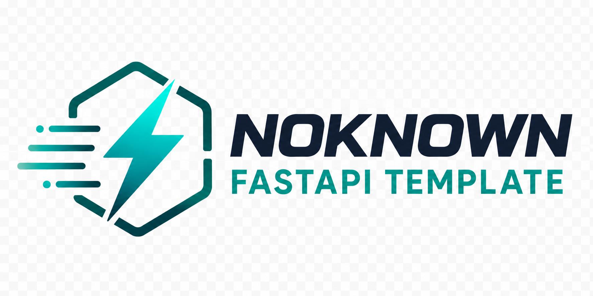

[](https://pypi.org/project/fastapi-template/)
[](https://pypistats.org/packages/fastapi-template)
<div align="center">

<div><i>NK Backend OS — a create-to-production FastAPI project generator.</i></div>
</div>

## Why NK Backend OS

NK Backend OS gives every generated FastAPI service a consistent foundation
while keeping business code yours. Choose a product use case or profile,
generate a project,
inspect its manifest, and use the same workflow from local development through
production.

The preferred workflow is product-first:

```text
Product idea → use case → architecture → generated backend
             → business modules → tests and operations → deployment
```

- **Profiles:** `minimal`, `saas`, `ai-saas`, `agentic`, and `fintech`
- **Generated CLI:** `nk doctor`, `validate`, `check`, `dev`, `build`, and `generate`
- **API Studio:** one branded surface for article docs, Swagger, and ReDoc
- **Composable integrations:** databases, ORMs, Redis, brokers, task queues,
  identity, tenancy, observability, AI, and fintech modules
- **Guardrails:** typed settings, feature validation, health checks,
  idempotency, audit trails, and generated CI/Docker workflows

## Quick start

Requires [Python 3.12+](https://www.python.org/), [uv](https://docs.astral.sh/uv/),
and [Git](https://git-scm.com/downloads). Docker is required for profiles that
run supporting services.

```bash
# Install the generator's development dependencies
uv sync

# Generate a service from a product-oriented architecture preset
uv run nk init my_app --use-case saas
cd my_app

# Install generated-project dependencies (or set NK_GENERATOR_INSTALL=1 before init)
uv sync
uv run nk doctor
uv run nk check
uv run nk dev          # prints the selected /api/docs URL
```

Build a production image with `uv run nk build`. Omit `--profile` and
`--use-case` to use the interactive generator and choose every API, database,
ORM, runtime, queue, authentication, and observability option yourself. A
selected use case maps to a complete architecture profile; explicit
`--profile` and feature flags remain available for advanced composition. After
generation, `nk` prints the resolved architecture contract.

## Install the CLI globally

Install the generator once, then use `nk` from any directory:

```bash
uv tool install /path/to/FastAPI-template
nk init my_app --profile minimal
```

For a published package, replace the local path with `fastapi-template`.
`nk init NAME` is the recommended command; `nk create` and
`fastapi_template` remain available as compatibility aliases.

## Choose a product use case

Use cases describe what you are building. They select the closest existing
platform profile and are recorded in `platform.yaml` alongside the resolved
profile.

```bash
nk init reliant --use-case enterprise-saas
nk init sampati --use-case data-platform
nk init knowledge --use-case ai-knowledge
nk init support_agent --use-case agentic
nk init payments --use-case fintech
```

| Use case | Intended product |
| --- | --- |
| `minimal-api` | Small APIs, prototypes, and internal utilities |
| `saas` | Multi-user SaaS products |
| `enterprise-saas` | Enterprise SaaS with tenancy, RBAC, audit, and integrations |
| `crud-platform` | CRUD-heavy business applications |
| `integration-api` | API integrations, webhooks, and external systems |
| `data-platform` | Data ingestion, processing, and asynchronous workflows |
| `search-platform` | Search, indexing, and retrieval systems |
| `knowledge-platform` | Document and knowledge products |
| `ai-saas` | AI-powered SaaS applications |
| `ai-knowledge` | RAG and enterprise knowledge systems |
| `agentic` | Tool-using AI applications |
| `automation-platform` | Workflow and task automation |
| `event-platform` | Event-driven and message-based systems |
| `fintech` | Transactional and financial workloads |
| `internal-tool` | Admin panels, operations, and internal systems |
| `developer-api` | Public APIs and developer platforms |
| `webhook-platform` | Reliable inbound and outbound webhook infrastructure |
| `high-scale-api` | High-throughput production APIs |
| `custom` | Fully composable architecture |

These use cases are product-oriented names, not claims that a dedicated CRM,
ERP, search, data, or high-scale domain pack is generated automatically.
Those products start from the nearest platform baseline and add business
modules with `nk generate`.

## Choose a profile

| Profile | Best for | Includes |
| --- | --- | --- |
| `minimal` | Small services and experiments | REST, example router, local-first defaults |
| `saas` | Production web APIs | PostgreSQL, SQLAlchemy, Redis, Taskiq, users, migrations, OTel, Prometheus |
| `ai-saas` | Retrieval-backed products | SaaS plus LLM, vector storage, and traditional RAG |
| `agentic` | Tool-using AI systems | AI SaaS plus agents, guardrails, memory, and GraphRAG |
| `fintech` | Transactional workloads | SaaS plus audit, idempotency, and fintech ledger primitives |

Profiles are the lower-level architecture presets. Explicit provider and
feature flags override profile defaults where supplied. For example:

```bash
nk init api --use-case data-platform --profile saas --taskiq --redis
```

Use `--use-case custom` or omit both selectors for fully interactive
composition.

## Generated-project workflow

| Command | Purpose |
| --- | --- |
| `nk doctor` | Check environment, imports, and generated wiring |
| `nk validate` | Validate project structure and `platform.yaml` |
| `nk check` | Run formatting, linting, typing, and tests |
| `nk dev` | Start the local API or the development Compose stack |
| `nk dev --reuse` | Reuse an existing Compose stack without rebuilding |
| `nk dev --new` | Start a second isolated Compose stack |
| `nk dev --otlp` | Include the local OpenTelemetry/Grafana observability overlay |
| `nk build` | Build the production Docker target |
| `nk start` | Start the production API without autoreload |
| `nk migrate` | Apply Alembic migrations when enabled |
| `nk seed` | Run the generated seed hook |
| `nk eval` | Run `tests/evals/golden.yaml` through the agent adapter |
| `nk jobs replay` | Replay selected or all dead-letter jobs |
| `nk deploy ENV` | Deploy the generated Helm stage (`staging`, `prod-s2`–`prod-s4`) |
| `nk scale-status` | Show the manifest scale stage and next trigger |
| `nk generate …` | Scaffold a business module |

Generated projects expose:

- `/api/docs` — API Studio and editorial documentation
- `/api/swagger` — interactive Swagger explorer
- `/api/redoc` — reference-oriented ReDoc view
- `/api/build-info` — version, image, profile, and Git metadata
- `/mcp` — Streamable HTTP-compatible capability endpoint for agent profiles

When OpenTelemetry is enabled, add
`-f deploy/docker-compose.otlp.yml` to the production Compose command to run
the pinned self-hosted Collector, Prometheus, Loki, Tempo, and Grafana stack.
Only Grafana is published; keep its administrator password in a secret
manager or deployment environment.

## Install and Docker variants

Install the published generator:

```bash
python -m pip install fastapi_template
python -m fastapi_template init toy --profile minimal
```

Generate with Docker when you do not want a local Python environment:

```bash
docker run --rm -it -v "$(pwd):/projects" ghcr.io/s3rius/fastapi_template
```

## Repository guide

| Path | What it contains |
| --- | --- |
| `fastapi_template/` | Generator package and Cookiecutter template |
| `fastapi_template/template/…/frontend/` | Generated React API Studio |
| `docs/wiki/` | Curated architecture, conventions, deployment, and data-model docs |
| `website/` | Docusaurus site for the complete EVA template documentation |
| `fastapi_template/tests/` | Generator and profile contract tests |

Read the [wiki index](docs/wiki/INDEX.md) for the architecture and the
[overview](docs/wiki/01-overview.md) for the first generated-project walkthrough.

## Documentation site

The Docusaurus site publishes `docs/wiki/` and keeps internal plans and session
notes out of the public documentation:

```bash
cd website
npm ci
npm run start       # local preview
npm run build       # production validation
npm run serve       # preview the build output
```

The site build fails on broken links and broken Markdown images. See the
[documentation reliability guide](docs/wiki/references/documentation-reliability.md)
when changing template capabilities.

## Development

```bash
uv sync
uv run pytest
uv run ruff check .
uv run ruff format --check .
```

Feature combinations are validated before Cookiecutter runs, so incompatible
database, ORM, AI, and fintech options fail with an actionable message.
