# Master Production AI / Agent / RAG Platform Architecture

> A production AI system is not a model wrapped in an API.
>
> It is a layered system combining compute, models, inference, data,
> retrieval, memory, caching, orchestration, tools, agents, validation,
> security, observability, evaluation, reproducibility, and operations.

---

# 1. Executive Architecture

```mermaid
flowchart TB

    %% ============================================================
    %% EXPERIENCE
    %% ============================================================

    subgraph EXPERIENCE["EXPERIENCE & APPLICATIONS"]
        direction LR

        WEB["Web / UI"]
        IDE["IDE / Copilot"]
        MOBILE["Mobile"]
        API["API / SDK"]
        ENTERPRISE["Enterprise Applications"]

        WEB --> GATEWAY
        IDE --> GATEWAY
        MOBILE --> GATEWAY
        API --> GATEWAY
        ENTERPRISE --> GATEWAY
    end


    %% ============================================================
    %% EDGE / SECURITY
    %% ============================================================

    subgraph EDGE["EDGE, IDENTITY & ACCESS"]
        direction LR

        GATEWAY["API Gateway"]

        AUTH["Authentication"]
        AUTHZ["Authorization"]
        RBAC["RBAC / ABAC"]
        TENANT["Tenant Isolation"]
        RATE["Rate Limits"]
        QUOTA["Quotas"]

        GATEWAY --> AUTH
        AUTH --> AUTHZ
        AUTHZ --> RBAC
        RBAC --> TENANT
        TENANT --> RATE
        RATE --> QUOTA
    end


    %% ============================================================
    %% APPLICATION / AGENT CONTROL
    %% ============================================================

    subgraph AGENT["AGENT & ORCHESTRATION PLANE"]
        direction TB

        ROUTER["Request / Task Router"]

        CLASSIFY["Task Classification"]
        REWRITE["Query Rewriting"]
        DECOMPOSE["Task Decomposition"]

        PLANNER["Planner"]

        ORCH["Agent Orchestrator"]

        WORKFLOW["Workflow Engine"]

        REACT["REACT Loop"]

        OBSERVE["Observe"]
        REASON["Reason"]
        ACT["Act"]
        VERIFY["Verify"]

        ROUTER --> CLASSIFY
        CLASSIFY --> REWRITE
        CLASSIFY --> DECOMPOSE

        REWRITE --> PLANNER
        DECOMPOSE --> PLANNER

        PLANNER --> ORCH
        ORCH --> WORKFLOW
        WORKFLOW --> REACT

        REACT --> OBSERVE
        OBSERVE --> REASON
        REASON --> ACT
        ACT --> VERIFY
        VERIFY --> OBSERVE
    end


    %% ============================================================
    %% AGENT HARNESS
    %% ============================================================

    subgraph HARNESS["AGENT HARNESS / RUNTIME"]
        direction LR

        RUNTIME["Execution Runtime"]

        PLUGINS["Plugin System"]

        TOOLS["Tool Registry"]
        MEMORY["Memory Provider"]
        MODEL_PROVIDER["Model Provider"]
        UI_PLUGIN["UI / Interface"]
        FS["Filesystem"]
        SHELL["Terminal / Shell"]

        DEP["Dependency Resolver"]
        LIFE["Lifecycle Manager"]
        CLEANUP["Teardown / Cleanup"]
        CONFIG["Runtime Configuration"]

        RUNTIME --> PLUGINS

        PLUGINS --> TOOLS
        PLUGINS --> MEMORY
        PLUGINS --> MODEL_PROVIDER
        PLUGINS --> UI_PLUGIN
        PLUGINS --> FS
        PLUGINS --> SHELL

        DEP --> PLUGINS
        LIFE --> PLUGINS
        CLEANUP --> LIFE
        CONFIG --> LIFE
    end


    %% ============================================================
    %% INTELLIGENCE / MODELS
    %% ============================================================

    subgraph MODEL["MODEL & INTELLIGENCE PLANE"]
        direction TB

        MODEL_ROUTER["Model Router"]

        SMALL["Fast / Small Model"]
        LARGE["Large / Reasoning Model"]
        MULTIMODAL["Multimodal Model"]
        SPECIALIZED["Specialized / Fine-Tuned Model"]

        PROMPT["Prompt Management"]
        CONTEXT["Context Management"]

        MODEL_ROUTER --> SMALL
        MODEL_ROUTER --> LARGE
        MODEL_ROUTER --> MULTIMODAL
        MODEL_ROUTER --> SPECIALIZED

        PROMPT --> CONTEXT
    end


    %% ============================================================
    %% MEMORY
    %% ============================================================

    subgraph MEMORYPLANE["MEMORY PLANE"]
        direction TB

        WORKING["Working Memory"]
        LONGTERM["Long-Term Memory"]

        CHECKPOINT["Checkpoint / Agent State"]

        FACTS["Facts"]
        PREFS["Preferences"]
        EVENTS["Events"]
        TOPICS["Topics"]
        ENTITIES["Entities"]
        SUMMARIES["Summaries"]

        WORKING --> CHECKPOINT
        LONGTERM --> FACTS
        LONGTERM --> PREFS
        LONGTERM --> EVENTS
        LONGTERM --> TOPICS
        LONGTERM --> ENTITIES
        LONGTERM --> SUMMARIES
    end


    %% ============================================================
    %% CACHE
    %% ============================================================

    subgraph CACHE["CACHE PLANE"]
        direction TB

        CACHE_GATE["Cache Gateway"]

        EXACT["Exact Cache"]
        SEMANTIC["Semantic Cache"]

        MODEL_CACHE["Model Response Cache"]
        TOOL_CACHE["Tool Result Cache"]
        SESSION_CACHE["Session Cache"]

        EMBEDDING["Query Embedding"]
        SIMILARITY["Similarity Search"]
        THRESHOLD["Similarity Threshold"]

        CACHE_GATE --> EXACT
        CACHE_GATE --> SEMANTIC

        EXACT --> MODEL_CACHE
        EXACT --> TOOL_CACHE
        EXACT --> SESSION_CACHE

        SEMANTIC --> EMBEDDING
        EMBEDDING --> SIMILARITY
        SIMILARITY --> THRESHOLD
    end


    %% ============================================================
    %% RETRIEVAL
    %% ============================================================

    subgraph RETRIEVAL["RETRIEVAL & CONTEXT ENGINEERING"]
        direction TB

        RETRIEVAL_ENGINE["Retrieval Orchestrator"]

        VECTOR["Vector Search"]
        KEYWORD["Keyword / BM25"]
        FILTER["Metadata Filtering"]
        GRAPH["Graph Retrieval"]

        FUSION["Hybrid Result Fusion"]
        RERANK["Re-Ranking"]

        COMPRESS["Context Compression"]
        SELECT["Context Selection"]
        BUILD["Context Builder"]

        RETRIEVAL_ENGINE --> VECTOR
        RETRIEVAL_ENGINE --> KEYWORD
        RETRIEVAL_ENGINE --> FILTER
        RETRIEVAL_ENGINE --> GRAPH

        VECTOR --> FUSION
        KEYWORD --> FUSION
        FILTER --> FUSION
        GRAPH --> FUSION

        FUSION --> RERANK
        RERANK --> COMPRESS
        COMPRESS --> SELECT
        SELECT --> BUILD
    end


    %% ============================================================
    %% KNOWLEDGE PLANE
    %% ============================================================

    subgraph KNOWLEDGE["KNOWLEDGE PLANE"]
        direction TB

        REGISTRY["Document Registry"]

        OBJECT["Object Storage"]
        RELATIONAL["Relational Database"]
        VECTORDB["Vector Database"]
        SEARCH["Search Index"]
        GRAPHDB["Knowledge Graph"]

        REGISTRY --> OBJECT
        REGISTRY --> RELATIONAL
        REGISTRY --> VECTORDB
        REGISTRY --> SEARCH
        REGISTRY --> GRAPHDB
    end


    %% ============================================================
    %% INGESTION
    %% ============================================================

    subgraph INGESTION["DATA INGESTION & PROCESSING"]
        direction TB

        SOURCES["Data Sources"]

        DOC["Documents"]
        CODE["Code"]
        SHEETS["Spreadsheets"]
        IMAGES["Images"]
        HTML["HTML / Web"]
        EMAIL["Email"]
        DBINPUT["Databases"]
        APIS["External APIs"]

        CONNECTORS["Connectors"]

        PARSER["Document Parser"]
        OCR["OCR / Vision"]
        STRUCTURE["Structure Analyzer"]
        CLEAN["Cleaning / Normalization"]
        DEDUP["Deduplication"]
        VERSION["Version Detection"]
        ACLMETA["Security / ACL Metadata"]

        CHUNK["Structure-Aware Chunking"]

        TABLE["Table Preservation"]
        HEADING["Heading Detection"]
        BOUNDARY["Boundary Detection"]

        METADATA["Metadata Creation"]

        SUMMARY["Summaries"]
        KEYWORDS["Keywords"]
        QUESTIONS["Hypothetical Questions"]

        EMBED_INDEX["Embedding Generation"]

        ENTITY["Entity Extraction"]
        RELATION["Relationship Extraction"]

        SOURCES --> CONNECTORS

        DOC --> CONNECTORS
        CODE --> CONNECTORS
        SHEETS --> CONNECTORS
        IMAGES --> CONNECTORS
        HTML --> CONNECTORS
        EMAIL --> CONNECTORS
        DBINPUT --> CONNECTORS
        APIS --> CONNECTORS

        CONNECTORS --> PARSER
        PARSER --> OCR
        OCR --> STRUCTURE
        STRUCTURE --> CLEAN
        CLEAN --> DEDUP
        DEDUP --> VERSION
        VERSION --> ACLMETA
        ACLMETA --> CHUNK

        CHUNK --> TABLE
        CHUNK --> HEADING
        CHUNK --> BOUNDARY
        CHUNK --> METADATA

        METADATA --> SUMMARY
        METADATA --> KEYWORDS
        METADATA --> QUESTIONS

        CHUNK --> EMBED_INDEX
        CHUNK --> ENTITY
        ENTITY --> RELATION
    end


    %% ============================================================
    %% TOOLS / PROTOCOLS
    %% ============================================================

    subgraph TOOLSPLANE["TOOLS & AGENT PROTOCOLS"]
        direction LR

        TOOL_REG["Tool Registry"]

        WEB_SEARCH["Web Search"]
        EXT_API["External APIs"]
        SQL["SQL / Analytics"]
        CODE_EXEC["Code Execution"]
        FILES["Files"]
        BROWSER["Browser"]
        INTERNAL["Internal Services"]

        MCP["MCP"]
        A2A["A2A"]

        TOOL_REG --> WEB_SEARCH
        TOOL_REG --> EXT_API
        TOOL_REG --> SQL
        TOOL_REG --> CODE_EXEC
        TOOL_REG --> FILES
        TOOL_REG --> BROWSER
        TOOL_REG --> INTERNAL

        MCP --> TOOL_REG
        A2A --> AGENTS
    end


    %% ============================================================
    %% MULTI AGENT
    %% ============================================================

    subgraph AGENTS["MULTI-AGENT SYSTEM"]
        direction TB

        AGENTS["Agent Coordinator"]

        RESEARCH["Research Agent"]
        RETRIEVAL_AGENT["Retrieval Agent"]
        DATA_AGENT["Data / SQL Agent"]
        CODE_AGENT["Code Agent"]
        DOMAIN_AGENT["Domain Agent"]
        VERIFY_AGENT["Verification Agent"]

        AGENTS --> RESEARCH
        AGENTS --> RETRIEVAL_AGENT
        AGENTS --> DATA_AGENT
        AGENTS --> CODE_AGENT
        AGENTS --> DOMAIN_AGENT
        AGENTS --> VERIFY_AGENT
    end


    %% ============================================================
    %% INFERENCE
    %% ============================================================

    subgraph SERVING["INFERENCE & SERVING"]
        direction LR

        SERVING_ROUTER["Inference Router"]

        QUANT["Quantization"]

        VLLM["vLLM"]
        TRT["TensorRT-LLM"]

        SPEC["Speculative Decoding"]

        LATENCY["Latency"]
        COST["Cost"]

        SERVING_ROUTER --> QUANT
        QUANT --> VLLM
        QUANT --> TRT

        VLLM --> SPEC
        TRT --> SPEC

        SPEC --> LATENCY
        SPEC --> COST
    end


    %% ============================================================
    %% VALIDATION
    %% ============================================================

    subgraph VALIDATION["VALIDATION & SAFETY"]
        direction TB

        VALIDATOR["Validation Pipeline"]

        GATEKEEPER["Gatekeeper"]
        GROUNDING["Grounding / Faithfulness"]
        FACTCHECK["Fact Verification"]
        RELEVANCE["Relevance"]
        CONSISTENCY["Consistency"]
        POLICY["Policy / Safety"]
        PII["PII / Sensitive Data"]
        INJECTION["Prompt Injection Defense"]
        AUDITOR["Auditor"]
        STRATEGIST["Strategist"]

        VALIDATOR --> GATEKEEPER
        VALIDATOR --> GROUNDING
        VALIDATOR --> FACTCHECK
        VALIDATOR --> RELEVANCE
        VALIDATOR --> CONSISTENCY
        VALIDATOR --> POLICY
        VALIDATOR --> PII
        VALIDATOR --> INJECTION
        VALIDATOR --> AUDITOR
        VALIDATOR --> STRATEGIST
    end


    %% ============================================================
    %% HUMAN IN THE LOOP
    %% ============================================================

    subgraph HITL["HUMAN-IN-THE-LOOP"]
        direction TB

        ESCALATION["Escalation Engine"]

        CONFIDENCE["Confidence Threshold"]
        BUSINESS_RULE["Business Rules"]
        RISK["Risk-Based Trigger"]
        ACTION["Action-Type Trigger"]

        QUEUE["Human Review Queue"]

        REVIEW["Human Review"]
        APPROVE["Approve"]
        CORRECT["Correct"]
        REJECT["Reject"]

        ESCALATION --> CONFIDENCE
        ESCALATION --> BUSINESS_RULE
        ESCALATION --> RISK
        ESCALATION --> ACTION

        CONFIDENCE --> QUEUE
        BUSINESS_RULE --> QUEUE
        RISK --> QUEUE
        ACTION --> QUEUE

        QUEUE --> REVIEW

        REVIEW --> APPROVE
        REVIEW --> CORRECT
        REVIEW --> REJECT
    end


    %% ============================================================
    %% CONTROL PLANE
    %% ============================================================

    subgraph CONTROL["CONTROL PLANE"]
        direction TB

        CONFIG["Configuration"]
        REGISTRY["Workflow / Model / Tool Registry"]
        DEPLOY["Deployment"]
        VERSIONING["Versioning"]
        ROLLBACK["Rollback"]
        RELEASE["Release Management"]
        FEATURE["Feature Flags"]
        SCALE["Scaling"]

        CONFIG --> REGISTRY
        REGISTRY --> DEPLOY
        DEPLOY --> VERSIONING
        VERSIONING --> ROLLBACK
        VERSIONING --> RELEASE
        RELEASE --> FEATURE
        DEPLOY --> SCALE
    end


    %% ============================================================
    %% OBSERVABILITY
    %% ============================================================

    subgraph OBS["OBSERVABILITY"]
        direction LR

        LOGS["Logs"]
        TRACES["Distributed Traces"]
        SCREENSHOTS["Screenshots / Artifacts"]
        METRICS["Metrics"]

        AGENT_TRACE["Agent Traces"]
        TOOL_TRACE["Tool Traces"]
        RETR_TRACE["Retrieval Traces"]
        MODEL_TRACE["Model Traces"]

        LATENCY_METRIC["Latency"]
        TOKEN_METRIC["Tokens"]
        ERROR_METRIC["Errors"]
        COST_METRIC["Cost"]

        DASH["Observability Dashboard"]

        LOGS --> DASH
        TRACES --> DASH
        SCREENSHOTS --> DASH
        METRICS --> DASH

        AGENT_TRACE --> DASH
        TOOL_TRACE --> DASH
        RETR_TRACE --> DASH
        MODEL_TRACE --> DASH

        LATENCY_METRIC --> DASH
        TOKEN_METRIC --> DASH
        ERROR_METRIC --> DASH
        COST_METRIC --> DASH
    end


    %% ============================================================
    %% EVALUATION
    %% ============================================================

    subgraph EVAL["EVALUATION & QUALITY"]
        direction TB

        EVALUATOR["Evaluation Framework"]

        GOLDEN["Golden Dataset"]
        SYNTHETIC["Synthetic Dataset"]

        LLMJUDGE["LLM Judges"]

        PRECISION["Precision"]
        RECALL["Recall"]
        FAITHFUL["Faithfulness"]
        RELEVANCE_EVAL["Relevance"]
        GROUNDED["Groundedness"]
        COMPLETENESS["Completeness"]
        CITATION["Citation Accuracy"]

        REGRESSION["Regression Testing"]
        AB["A/B Experiments"]

        EVALUATOR --> GOLDEN
        EVALUATOR --> SYNTHETIC
        EVALUATOR --> LLMJUDGE
        EVALUATOR --> PRECISION
        EVALUATOR --> RECALL
        EVALUATOR --> FAITHFUL
        EVALUATOR --> RELEVANCE_EVAL
        EVALUATOR --> GROUNDED
        EVALUATOR --> COMPLETENESS
        EVALUATOR --> CITATION
        EVALUATOR --> REGRESSION
        EVALUATOR --> AB
    end


    %% ============================================================
    %% RED TEAMING
    %% ============================================================

    subgraph REDTEAM["RED TEAMING / ADVERSARIAL TESTING"]
        direction TB

        RED["Red Team Engine"]

        PROMPTINJ["Prompt Injection"]
        JAILBREAK["Jailbreaks"]
        LEAK["Data Leakage"]
        POISON["Retrieval Poisoning"]
        MALDOC["Malicious Documents"]
        TOOLABUSE["Tool Abuse"]
        CONTEXTATTACK["Context Manipulation"]
        BIAS["Bias / Harmful Outputs"]

        RED --> PROMPTINJ
        RED --> JAILBREAK
        RED --> LEAK
        RED --> POISON
        RED --> MALDOC
        RED --> TOOLABUSE
        RED --> CONTEXTATTACK
        RED --> BIAS
    end


    %% ============================================================
    %% REPRODUCIBILITY
    %% ============================================================

    subgraph REPRO["REPRODUCIBILITY"]
        direction LR

        ENVDEF["Environment Definition"]

        PYTHON["Runtime / Python"]
        CUDA["CUDA / Drivers"]
        LIBS["Libraries"]
        MODELS["Model Versions"]
        TOOLS_VERSION["Tool Versions"]
        MCP_VERSION["MCP Versions"]
        CONFIG_VERSION["Configuration Versions"]

        DEV["Development"]
        CI["CI"]
        STAGING["Staging"]
        PROD["Production"]

        ENVDEF --> PYTHON
        ENVDEF --> CUDA
        ENVDEF --> LIBS
        ENVDEF --> MODELS
        ENVDEF --> TOOLS_VERSION
        ENVDEF --> MCP_VERSION
        ENVDEF --> CONFIG_VERSION

        ENVDEF --> DEV
        ENVDEF --> CI
        ENVDEF --> STAGING
        ENVDEF --> PROD
    end


    %% ============================================================
    %% SECURITY / GOVERNANCE
    %% ============================================================

    subgraph GOV["SECURITY, GOVERNANCE & COMPLIANCE"]
        direction LR

        SECRETS["Secrets Management"]
        ENCRYPT["Encryption"]
        DLP["DLP"]
        AUDIT["Audit Logs"]
        ACCESS["Access Policies"]
        RETENTION["Retention Policies"]
        COMPLIANCE["Compliance"]
        DATA_GOV["Data Governance"]
    end


    %% ============================================================
    %% PRIMARY FLOW
    %% ============================================================

    QUOTA --> ROUTER

    ORCH --> MODEL_ROUTER
    ORCH --> CACHE_GATE
    ORCH --> RETRIEVAL_ENGINE
    ORCH --> AGENTS
    ORCH --> TOOL_REG

    REACT --> CACHE_GATE
    REACT --> TOOLSPLANE

    CONTEXT --> MODEL_ROUTER

    MODEL_ROUTER --> SERVING_ROUTER

    SERVING_ROUTER --> VALIDATOR

    VALIDATOR --> HITL

    HITL --> ORCH

    VALIDATOR --> FINAL["Final Response"]


    %% ============================================================
    %% MEMORY
    %% ============================================================

    ORCH --> WORKING
    WORKFLOW --> CHECKPOINT

    WORKING --> CACHE_GATE
    LONGTERM --> RETRIEVAL_ENGINE


    %% ============================================================
    %% CACHE TARGETS
    %% ============================================================

    MODEL_CACHE -. miss .-> MODEL_PROVIDER
    TOOL_CACHE -. miss .-> TOOL_REG
    SESSION_CACHE -. miss .-> MEMORY

    MODEL_CACHE --> MODEL
    TOOL_CACHE --> TOOLS
    SESSION_CACHE --> MEMORY


    %% ============================================================
    %% KNOWLEDGE
    %% ============================================================

    CONNECTORS --> PARSER

    EMBED_INDEX --> VECTORDB
    METADATA --> RELATIONAL
    RELATION --> GRAPHDB
    ENTITY --> GRAPHDB


    VECTORDB --> VECTOR
    SEARCH --> KEYWORD
    RELATIONAL --> FILTER
    GRAPHDB --> GRAPH


    %% ============================================================
    %% TOOLS
    %% ============================================================

    TOOLSPLANE --> ACT


    %% ============================================================
    %% OBSERVABILITY
    %% ============================================================

    RUNTIME -. telemetry .-> OBS
    ORCH -. telemetry .-> OBS
    CACHE_GATE -. telemetry .-> OBS
    RETRIEVAL_ENGINE -. telemetry .-> OBS
    MODEL_ROUTER -. telemetry .-> OBS
    SERVING_ROUTER -. telemetry .-> OBS
    VALIDATOR -. telemetry .-> OBS
    HITL -. telemetry .-> OBS


    %% ============================================================
    %% EVALUATION
    %% ============================================================

    OBS --> EVALUATOR
    VALIDATOR --> EVALUATOR
    RETRIEVAL_ENGINE --> EVALUATOR
    FINAL --> EVALUATOR

    EVALUATOR -. feedback .-> PLANNER
    EVALUATOR -. feedback .-> MODEL_ROUTER
    EVALUATOR -. feedback .-> RETRIEVAL_ENGINE
    EVALUATOR -. feedback .-> CACHE_GATE
    EVALUATOR -. feedback .-> WORKFLOW


    %% ============================================================
    %% RED TEAM
    %% ============================================================

    RED -. attacks .-> ORCH
    RED -. attacks .-> RETRIEVAL_ENGINE
    RED -. attacks .-> MODEL_ROUTER
    RED -. attacks .-> TOOL_REG
    RED -. attacks .-> VALIDATOR
    RED -. attacks .-> KNOWLEDGE


    %% ============================================================
    %% GOVERNANCE
    %% ============================================================

    GOV -. governs .-> EXPERIENCE
    GOV -. governs .-> AGENT
    GOV -. governs .-> HARNESS
    GOV -. governs .-> MODEL
    GOV -. governs .-> MEMORYPLANE
    GOV -. governs .-> CACHE
    GOV -. governs .-> RETRIEVAL
    GOV -. governs .-> KNOWLEDGE
    GOV -. governs .-> TOOLSPLANE
    GOV -. governs .-> VALIDATION
    GOV -. governs .-> CONTROL


    %% ============================================================
    %% REPRODUCIBILITY
    %% ============================================================

    REPRO -. controls .-> HARNESS
    REPRO -. controls .-> MODEL
    REPRO -. controls .-> SERVING
    REPRO -. controls .-> TOOLSPLANE
    REPRO -. controls .-> CONTROL
```

---

# 2. Architectural Model

The system is divided into four major planes.

```text
┌─────────────────────────────────────────────────────────────┐
│                    EXPERIENCE PLANE                         │
│                                                             │
│ Web │ IDE │ Mobile │ API │ Enterprise Applications          │
└──────────────────────────────┬──────────────────────────────┘
                               │
                               ▼
┌─────────────────────────────────────────────────────────────┐
│                  INTELLIGENCE / AGENT PLANE                 │
│                                                             │
│ Router → Planner → Orchestrator → Workflow → Agents         │
│                                                             │
│ REACT: Observe → Reason → Act → Verify                      │
└──────────────────────────────┬──────────────────────────────┘
                               │
             ┌─────────────────┼─────────────────┐
             ▼                 ▼                 ▼
       ┌───────────┐     ┌────────────┐     ┌────────────┐
       │   MODEL   │     │  RETRIEVAL │     │   TOOLS    │
       │   PLANE   │     │   PLANE    │     │   PLANE    │
       └───────────┘     └────────────┘     └────────────┘
             │                 │                 │
             └─────────────────┼─────────────────┘
                               ▼
┌─────────────────────────────────────────────────────────────┐
│                     DATA / STATE PLANE                      │
│                                                             │
│ Memory │ Cache │ Vector DB │ Relational DB │ Object Store   │
│ Search │ Knowledge Graph │ Session State │ Checkpoints      │
└─────────────────────────────────────────────────────────────┘


                CROSS-CUTTING CONTROL PLANES
```


┌─────────────────────────────────────────────────────────────┐
│ Security │ Governance │ Observability │ Evaluation           │
│ Red Teaming │ Reproducibility │ Control Plane              │
└─────────────────────────────────────────────────────────────┘

```

---

# 3. AI Stack

The lower-level AI stack remains:

```text
6. Applications & Products
5. Orchestration & Agents
4. Data, Retrieval & Protocols
3. Inference & Serving
2. Model Training & Development
1. Compute & Infrastructure
```

The important point is that **governance, observability, and reproducibility are not additional application layers**. They operate across the stack.

---

# 4. Layer 1 — Compute & Infrastructure

```text
Compute
├── GPUs
├── TPUs
├── Trainium / Other Accelerators
│
├── Cloud
├── On-Prem
└── Edge

Software Substrate
├── Drivers
├── CUDA / Accelerator Runtime
├── Libraries
└── Hardware-Specific Dependencies
```

Responsibilities:

- provide compute capacity
- support training
- support inference
- support batch workloads
- provide scaling
- provide accelerator-specific runtimes
- maintain reproducible environments

---

# 5. Layer 2 — Model Training & Development

```text
Model Development
├── Frontier Models
├── Open-Weight Models
├── Fine-Tuning
├── Specialized Models
└── Model Selection
```

The model should be selected per task rather than assuming one model is optimal for every operation.

```text
Simple Task
    ↓
Small / Fast Model

Complex Reasoning
    ↓
Large / Reasoning Model

Visual Task
    ↓
Multimodal Model

Specialized Task
    ↓
Fine-Tuned Model
```

---

# 6. Layer 3 — Inference & Serving

```text
Model Artifact
     ↓
Optimization
     ├── Quantization
     └── Speculative Decoding
     ↓
Serving Runtime
     ├── vLLM
     └── TensorRT-LLM
     ↓
Routing
     ├── Fast Model
     └── Capable Model
     ↓
Cost / Latency
```

The serving layer is where the model becomes a production service.

---

# 7. Layer 4 — Data, Retrieval & Protocols

```text
Data
├── Documents
├── Code
├── Products
├── Customer Data
├── Databases
└── Internal Knowledge

Retrieval
├── Vector Search
├── Keyword Search
├── Hybrid Search
├── Metadata Filtering
├── Re-Ranking
└── Context Construction

Protocols
├── MCP
└── A2A
```

Basic RAG:

```text
Document
   ↓
Chunk
   ↓
Embedding
   ↓
Vector Index

User Query
   ↓
Embedding
   ↓
Retrieval
   ↓
Relevant Context
   ↓
LLM
```

Production RAG:

```text
Query
 ↓
Classification
 ↓
Rewrite / Expansion / Decomposition
 ↓
Hybrid Retrieval
 ├── Vector
 ├── Keyword
 ├── Metadata
 └── Graph
 ↓
Fusion
 ↓
Re-Ranking
 ↓
Context Compression
 ↓
Context Selection
 ↓
Generation
```

The source emphasizes hybrid search, metadata filtering, and reranking as major improvements over basic vector retrieval.  

---

# 8. Layer 5 — Orchestration & Agents

```text
User Task
   ↓
Understand
   ↓
Plan
   ↓
Decompose
   ↓
Execute
   ↓
Observe
   ↓
Verify
   ↓
Continue / Retry / Reroute / Escalate
```

A production agent is a workflow engine around a model.

It is not simply:

```text
prompt → LLM → answer
```

It is:

```text
prompt
  ↓
planner
  ↓
workflow
  ↓
agent
  ↓
tool
  ↓
observation
  ↓
verification
  ↓
next action
```

---

# 9. Layer 6 — Applications & Products

```text
Applications
├── Copilots
├── Vertical AI
├── Enterprise Applications
├── Developer Tools
├── Workflow Automation
├── Integrations
└── Trust / Control Features
```

The application layer owns the user workflow.

The intelligence stack underneath it should remain replaceable.

---

# 10. Agent Runtime

The runtime is responsible for turning model decisions into controlled execution.

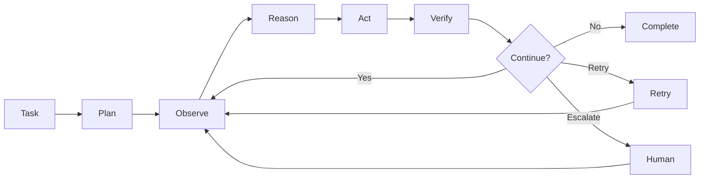


The reliability source explicitly frames the loop as **Observe → Reason → Act → Verify → Repeat**, rather than assuming that a previous action succeeded. 

---

# 11. Workflow as a State Machine

A production workflow should be representable as state.

```text
State
├── current_step
├── previous_step
├── expected_outcome
├── actual_outcome
├── available_tools
├── active_memory
├── retry_count
├── escalation_state
├── workflow_version
└── execution_id
```

Example:

```text
START
  ↓
BROWSE
  ↓
SELECT
  ↓
FILL
  ↓
VERIFY
  ↓
PAYMENT
  ↓
VERIFY
  ↓
COMPLETE
```

Every transition should be observable.

---

# 12. Agent Harness

The harness surrounds the model.

```text
                    ┌───────────────┐
                    │     MODEL     │
                    └───────┬───────┘
                            │
                    ┌───────▼───────┐
                    │    HARNESS    │
                    │               │
                    │ State         │
                    │ Memory        │
                    │ Tools         │
                    │ Files         │
                    │ Shell         │
                    │ Browser       │
                    │ Sessions      │
                    │ Configuration │
                    │ Recovery      │
                    └───────────────┘
```

The harness provides everything required to turn model output into real-world action. The source describes file access, commands, session management, tool use, and model interchangeability as harness responsibilities. 

---

# 13. Plugin Architecture

The harness should be modular.

```text
Harness
├── Model Plugin
├── Memory Plugin
├── Tool Plugin
├── File Plugin
├── Shell Plugin
├── Browser Plugin
├── UI Plugin
└── Storage Plugin
```

A plugin should declare:

```text
Plugin
├── name
├── version
├── capabilities
├── dependencies
├── configuration
├── resources
└── teardown
```

The source's plugin model is based on interchangeable components rather than a single hard-wired program. 

---

# 14. Plugin Lifecycle

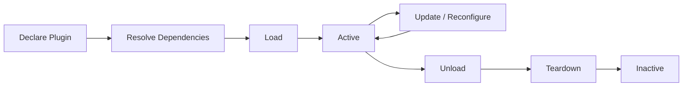


The key rule:

```text
Every resource acquisition
        +
Every resource release
```

should be represented together.

---

# 15. Dependency Management

Bad:

```text
Logger
   ↓
Specific Database
```

Better:

```text
Logger
   ↓
Requires: Logging Sink

Runtime
   ↓
Resolves current provider
```

The source describes dependency declaration and dynamic reconnection when an underlying provider changes. 

---

# 16. Safe Teardown

If:

```text
A → B → C
```

was the dependency order, teardown should happen:

```text
C → B → A
```

Never remove a provider while an active dependent still requires it.

This prevents:

```text
Dependent
    ↓
Resource already destroyed
    ↓
Runtime failure
```

The source specifically emphasizes reverse-order teardown and dependency-aware cleanup.  

---

# 17. Memory Architecture

Memory is not one thing.

```text
                    MEMORY
                       │
          ┌────────────┴────────────┐
          ▼                         ▼
    WORKING MEMORY           LONG-TERM MEMORY
          │                         │
          ▼                         ▼
    Current State              Facts
    Tool Results               Preferences
    Scratch State              Events
    Conversation              Topics
    Checkpoints                Entities
                               Summaries
```

The source identifies working memory as state that must survive process restarts and be shared across instances, while long-term memory stores durable facts, preferences, and events. 

---

# 18. Working Memory

Working memory stores what the agent needs **right now**.

```text
Execution
├── Current messages
├── Current plan
├── Tool results
├── Intermediate outputs
├── Current browser state
├── Current step
└── Checkpoint
```

Requirements:

- durable
- fast
- externally stored
- recoverable
- shared across workers
- checkpointed

---

# 19. Checkpointing

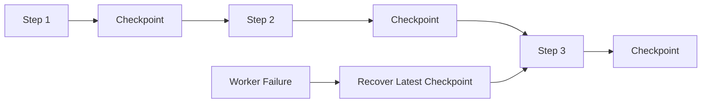


A checkpoint makes the workflow resumable instead of forcing the agent to restart from zero.

---

# 20. Long-Term Memory

Long-term memory should contain structured knowledge rather than dumping every message into a vector store.

```text
Conversation
     ↓
Extraction
     ├── Facts
     ├── Preferences
     ├── Events
     ├── Topics
     ├── Entities
     └── Summaries
          ↓
     Deduplication
          ↓
     Memory Store
          ↓
     Semantic Retrieval
```

The source describes extracting topics, entities, summaries, and deduplicated structured facts before storing them for later semantic retrieval. 

---

# 21. Memory Scoping

Every memory item should have a scope.

```text
Global
Organization
Tenant
Team
User
Session
Agent
Workflow
Task
```

Example:

```text
memory_key =
    tenant
    +
    user
    +
    memory_type
    +
    identity
```

This avoids cross-user memory leakage.

---

# 22. Retrieval Architecture

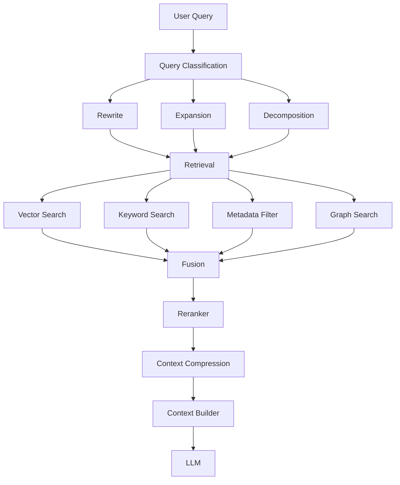


---

# 23. Hybrid Search

Use:

```text
Semantic Search
+
Keyword Search
```

because they solve different problems.

```text
Semantic Search
→ meaning
```


Keyword Search
→ exact terms
→ names
→ product codes
→ order numbers
→ error codes

```

The source explicitly identifies exact-match weaknesses in pure vector search and recommends hybrid search. 

---

# 24. Metadata Filtering

Retrieval should narrow the search space.

```text
Query
 +
Tenant
 +
User
 +
Department
 +
Document Type
 +
Date Range
 +
Version
 +
Permissions
```

Then perform vector retrieval.

Conceptually:

```text
Authorized Slice
       ↓
Hybrid Retrieval
       ↓
Reranking
```

The source specifically emphasizes filtering by metadata such as user, product constraints, or recent time windows. 

---

# 25. Re-Ranking

```text
1000 candidate documents
        ↓
Fast Retrieval
        ↓
50 candidates
        ↓
Re-Ranker
        ↓
Top 5–10 candidates
```

Retrieval finds candidates.

Reranking decides which candidates are actually useful.

---

# 26. Knowledge Storage

The knowledge plane should separate concerns.

```text
Object Storage
    ↓
Original / Canonical Documents

Relational Database
    ↓
Metadata / Relationships / Versions / ACLs

Vector Database
    ↓
Embeddings / Semantic Search

Search Index
    ↓
Keyword Search

Knowledge Graph
    ↓
Entities / Relationships
```

A single database can sometimes cover multiple roles, but the architecture should model the roles independently.

---

# 27. Document Processing

```mermaid
flowchart LR

    RAW["Raw Source"]

    RAW --> PARSE["Parse"]

    PARSE --> VISION["OCR / Vision"]

    VISION --> STRUCT["Structure Analysis"]

    STRUCT --> CLEAN["Clean"]

    CLEAN --> DEDUP["Deduplicate"]

    DEDUP --> VERSION["Version"]

    VERSION --> ACL["ACL Metadata"]

    ACL --> CHUNK["Structure-Aware Chunking"]

    CHUNK --> META["Metadata"]

    META --> INDEX["Index"]
```


---

# 28. Structure-Aware Chunking

Do not blindly:

```text
split every N tokens
```

Prefer:

```text
Heading
  ↓
Related Content
  ↓
Table
  ↓
Section
  ↓
Boundary
```

Useful metadata:

```text
document_id
chunk_id
parent_document
section
heading
page
version
source
timestamp
tenant
permissions
document_type
language
```

---

# 29. Metadata Enrichment

Each chunk may contain:

```text
Content
+
Summary
+
Keywords
+
Hypothetical Questions
+
Entities
+
Relationships
+
Source Metadata
+
Security Metadata
```

The source specifically describes summary generation, keyword extraction, and hypothetical question generation as retrieval-oriented metadata. 

---

# 30. Embeddings

```text
Text
 ↓
Embedding Model
 ↓
Vector
 ↓
Vector Index
```

The embedding layer should be abstracted:

```text
Embedding Provider
        ↓
Embedding Interface
        ↓
Application
```

This allows the provider to change without rewriting retrieval logic.

---

# 31. Agent Cache Architecture

Caching belongs **inside the agent execution path**, not merely beside the database.

```text
                 AGENT
                   │
                   ▼
             CACHE GATEWAY
                   │
        ┌──────────┴──────────┐
        ▼                     ▼
    EXACT CACHE         SEMANTIC CACHE
        │                     │
        ▼                     ▼
      Key                   Embedding
        │                     │
        ▼                     ▼
   Lookup                  Vector Search
        │                     │
        └──────────┬──────────┘
                   ▼
              CACHE HIT?
              /        \
            YES         NO
             │           │
             ▼           ▼
          Return      Execute
```

The source identifies three main repeated operations: model calls, tool calls, and session reads. 

---

# 32. Exact Cache

```text
Request
 ↓
Canonicalization
 ↓
Deterministic Key
 ↓
Lookup
 ├── HIT  → Return
 └── MISS → Execute → Store
```

Targets:

```text
Model Response
Tool Result
Session Read
```

---

# 33. Semantic Cache

```text
Question
 ↓
Embedding
 ↓
Vector Search
 ↓
Similarity Score
 ↓
Threshold
 ├── Above → Reuse
 └── Below → Execute
```

Semantic caching exists to catch meaning-equivalent requests with different wording. 

---

# 34. Cache Threshold

Too strict:

```text
Few false positives
Many false negatives
```

Too loose:

```text
Many false positives
Potentially wrong reused answers
```

Therefore:

```text
Threshold
+
Question Type
+
Risk
+
Freshness
```

should determine cache reuse.

---

# 35. Cache Targets


| Target           | Cache Strategy                  |
| ---------------- | ------------------------------- |
| Model call       | Exact + controlled semantic     |
| Tool result      | Exact + TTL-aware               |
| Session read     | Exact                           |
| Embedding        | Exact                           |
| Retrieval result | Exact / version-aware           |
| Final answer     | Exact / semantic only when safe |


---

# 36. Cache Invalidation

Cache invalidation must be explicit.

```text
Data Change
   ↓
Affected Version
   ↓
Invalidate Related Entries
   ↓
Next Request
   ↓
Recompute
```

Useful mechanisms:

```text
TTL
Version Keys
Event-Based Invalidation
Manual Invalidation
Namespace Invalidation
```

---

# 37. Version-Aware Cache Keys

A production key should encode relevant versions.

```text
cache_key =
    tenant
    +
    model_version
    +
    prompt_version
    +
    tool_version
    +
    data_version
    +
    schema_version
    +
    request
```

This prevents old results from surviving incompatible system changes.

---

# 38. Never Cache Blindly

Avoid unrestricted caching for:

```text
Highly dynamic information
One-time mutations
Current authorization state
Sensitive personalized results
Non-idempotent actions
Security-sensitive operations
Stale-prone external data
```

---

# 39. Multi-Tenant Cache Isolation

```text
Tenant A
   ↓
Namespace A
   ↓
Cache A

Tenant B
   ↓
Namespace B
   ↓
Cache B
```

Never allow:

```text
Tenant A request
      ↓
Cached Tenant B answer
```

Every cache access should be permission-aware.

---

# 40. Tools

```text
Tool Registry
├── Web Search
├── Browser
├── Files
├── SQL
├── APIs
├── Code Execution
├── Internal Services
└── Business Systems
```

Tools should be:

```text
Discoverable
Versioned
Permissioned
Observable
Timeout-controlled
Retry-aware
Cache-aware
```

---

# 41. Protocols

## MCP

```text
Agent
  ↓
MCP
  ↓
Tools / Data
```

## A2A

```text
Agent A
   ↓
A2A
   ↓
Agent B
```

Protocols should sit behind interfaces rather than being embedded deeply into business logic.

---

# 42. Multi-Agent Architecture

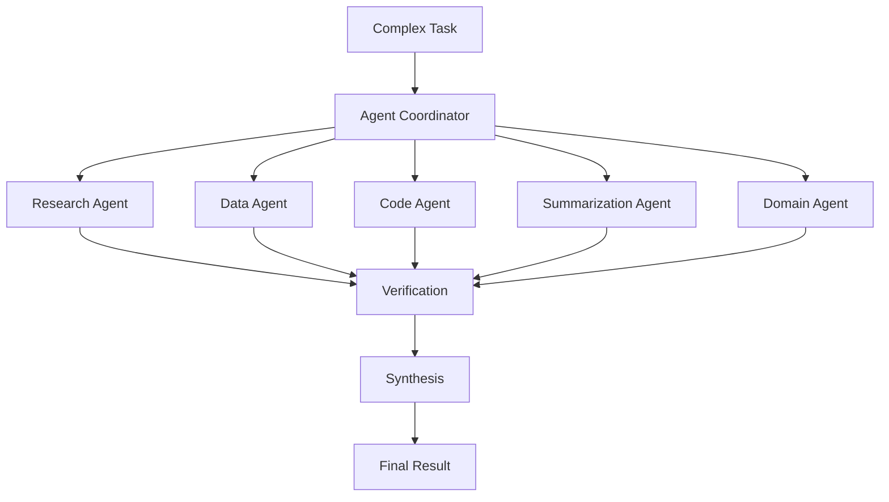


Use multiple agents when specialization improves the system.

Do not create a committee of agents merely because one model felt lonely.

---

# 43. Verification

Every important action should have a post-condition.

```text
Action
 ↓
Expected Outcome
 ↓
Actual Outcome
 ↓
Compare
 ├── PASS → Continue
 ├── RETRY → Retry
 ├── REROUTE → Alternate path
 └── ESCALATE → Human
```

The reliability source explicitly treats post-condition checks as the difference between assuming success and verifying success. 

---

# 44. Recovery

A reliable agent should support:

```text
Retry
Replan
Reroute
Fallback Tool
Fallback Model
Rollback
Checkpoint Recovery
Human Escalation
Safe Stop
```

Never:

```text
error
 ↓
pretend success
 ↓
continue
```

That is how a five-second failure becomes a twenty-minute catastrophe.

---

# 45. Guardrails

Guardrails should operate at infrastructure level.

```text
Allowed Domains
Allowed Tools
Allowed Actions
Permissions
Rate Limits
Data Policies
Risk Policies
Budget Limits
```

The reliability source explicitly describes constrained agents, domain restrictions, permissions, rate limits, and risky-action controls. 

---

# 46. Human-in-the-Loop

A serious agent needs an escape hatch.

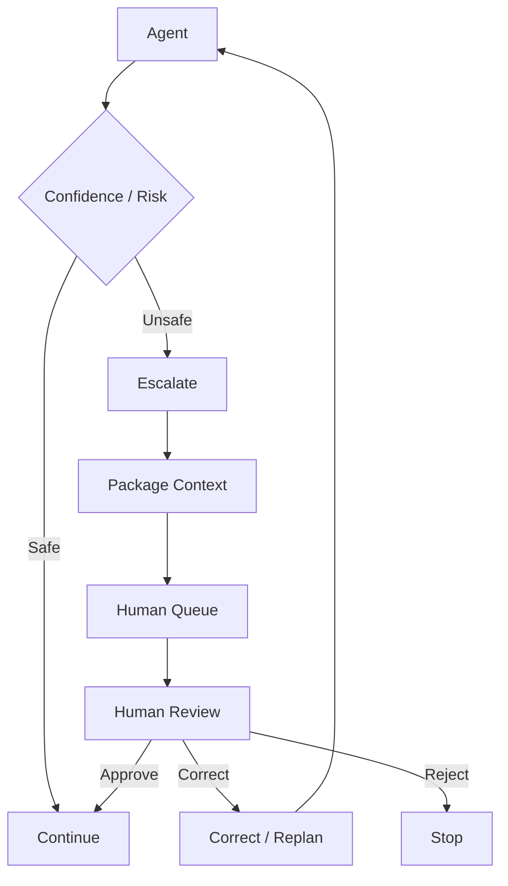


The human review package should include:

```text
Task
Current state
Screenshot / artifact
URL / resource
Execution trace
Previous actions
Proposed action
Reason for escalation
```

The source explicitly describes packaging context, screenshots, URLs, execution traces, and the attempted action for human review. 

---

# 47. Escalation at Scale

Do not have humans watching every workflow.

Use:

```text
Confidence threshold
+
Risk level
+
Business rules
+
Action type
+
Priority
```

Then route to:

```text
Queue
 ↓
Priority
 ↓
Human
```

Human decisions become feedback data.

The source explicitly highlights this feedback loop: corrections reveal which conditions require escalation and which the agent can safely handle itself. 

---

# 48. Observability

A production agent should produce a trace like:

```text
Execution
├── Request
├── Plan
├── Step 1
│   ├── Observation
│   ├── Reasoning
│   ├── Action
│   └── Verification
├── Step 2
├── Tool Calls
├── Retrieval
├── Model Calls
├── Cache Events
├── Escalations
└── Final Result
```

The reliability material explicitly describes workflow traces, step-level telemetry, screenshots, timings, and failure reasons. 

---

# 49. Core Metrics

## Agent

```text
Success Rate
Completion Rate
Retry Rate
Escalation Rate
Failure Rate
Average Steps
```

## Retrieval

```text
Precision
Recall
MRR / Ranking Quality
Retrieval Latency
Context Size
```

## Model

```text
Latency
Tokens
Cost
Error Rate
Fallback Rate
```

## Cache

```text
Hit Rate
Miss Rate
Semantic Hit Rate
False-Hit Rate
Saved Tokens
Saved Cost
Lookup Latency
```

## Tools

```text
Success Rate
Failure Rate
Timeout Rate
Retry Rate
Latency
```

---

# 50. Evaluation

Evaluation should test the system continuously.

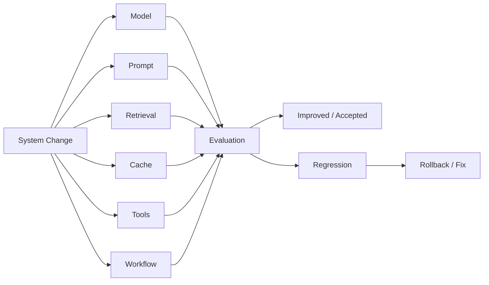


The source stresses that evaluation is what tells you whether a change actually improved the system rather than silently breaking other behavior. 

---

# 51. Evaluation Dimensions

```text
Answer
├── Faithfulness
├── Relevance
├── Groundedness
├── Completeness
├── Citation Accuracy
└── Correctness
```


Retrieval
├── Precision
├── Recall
└── Ranking Quality

System
├── Latency
├── Cost
├── Reliability
└── Throughput

```

---

# 52. Golden Dataset

Maintain a fixed evaluation set.

```text
Golden Dataset
├── Simple Queries
├── Complex Queries
├── Ambiguous Queries
├── Edge Cases
├── Failure Cases
├── Safety Cases
├── Retrieval Cases
└── Regression Cases
```

Every important architecture change should run against it.

---

# 53. Red Teaming

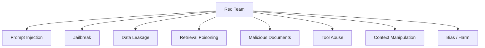


The goal is not to prove that the system is unbreakable.

The goal is to find how it breaks before production does.

---

# 54. Security Model

Security should exist at every layer.

```text
Identity
   ↓
Tenant Isolation
   ↓
Authorization
   ↓
Data ACL
   ↓
Retrieval Filtering
   ↓
Tool Permissions
   ↓
Model Context
   ↓
Output Validation
   ↓
Audit
```

---

# 55. Prompt Injection Defense

Treat external content as untrusted.

```text
User Input ─────────┐
                    │
Retrieved Content ──┼──► Policy Boundary
                    │
Tool Output ────────┘
                         │
                         ▼
                   Model Context
```

Never assume retrieved content is trustworthy simply because your system retrieved it.

---

# 56. Tool Security

Each tool should declare:

```text
Tool
├── Capability
├── Permission
├── Risk Level
├── Input Schema
├── Output Schema
├── Timeout
├── Budget
└── Audit Policy
```

Example:

```text
read_file
  risk = low

send_email
  risk = medium

execute_payment
  risk = high
  requires = human approval
```

---

# 57. Governance

Governance spans:

```text
Models
Data
Agents
Tools
Users
Tenants
Workflows
Deployments
```

Controls include:

```text
Audit Logs
Policies
Retention
Compliance
Access
DLP
Secrets
Encryption
Cost Controls
```

---

# 58. Reproducibility

The same environment should move through:

```text
Development
      ↓
CI
      ↓
Staging
      ↓
Production
```

with one defined environment.

Version:

```text
Runtime
Python
Drivers
CUDA
Libraries
Models
Prompts
Tools
MCP Servers
Configuration
Schemas
```

The source identifies environment drift across laptop, CI, and production as a major reliability problem. 

---

# 59. Control Plane

The control plane manages the system rather than performing user work.

```text
Control Plane
├── Configuration
├── Workflow Registry
├── Model Registry
├── Tool Registry
├── Versioning
├── Deployment
├── Rollbacks
├── Feature Flags
├── Scaling
└── Policy Management
```

The reliability material explicitly puts deployment, versioning, scaling, promotion, monitoring, and rollback into the control plane. 

---

# 60. Runtime Plane vs Control Plane

```text
                 CONTROL PLANE
                      │
        ┌─────────────┼─────────────┐
        ▼             ▼             ▼
    Config         Policy        Version
        │             │             │
        └─────────────┼─────────────┘
                      ▼
                 RUNTIME PLANE
                      │
        ┌─────────────┼─────────────┐
        ▼             ▼             ▼
      Agents        Tools          Models
```

This separation keeps operational management independent from request execution.

---

# 61. Production Request Lifecycle

```text
1. Request
   ↓
2. Authentication
   ↓
3. Authorization
   ↓
4. Tenant Resolution
   ↓
5. Query Classification
   ↓
6. Cache Lookup
   ↓
7. Planning
   ↓
8. Retrieval / Tools / Agents
   ↓
9. Context Construction
   ↓
10. Model Invocation
   ↓
11. Verification
   ↓
12. Guardrails
   ↓
13. Human Escalation if required
   ↓
14. Final Response
   ↓
15. Trace / Metrics / Evaluation
```

---

# 62. Production Knowledge Lifecycle

```text
Source
 ↓
Connector
 ↓
Parser
 ↓
OCR / Vision
 ↓
Structure Analysis
 ↓
Cleaning
 ↓
Deduplication
 ↓
Versioning
 ↓
ACL
 ↓
Chunking
 ↓
Metadata
 ↓
Embeddings
 ↓
Indexes
 ↓
Retrieval
 ↓
Evaluation
 ↓
Re-index / Improve
```

---

# 63. Production Agent Lifecycle

```text
Define
 ↓
Configure
 ↓
Develop
 ↓
Test
 ↓
Evaluate
 ↓
Red Team
 ↓
Deploy
 ↓
Observe
 ↓
Scale
 ↓
Update
 ↓
Rollback if necessary
```

---

# 64. Cache Lifecycle

```text
Request
 ↓
Exact Lookup
 ↓
Semantic Lookup
 ↓
Miss
 ↓
Execute
 ↓
Store
 ↓
Observe
 ↓
Analyze
 ↓
Tune
 ↓
Repeat
```

---

# 65. Self-Tuning Cache

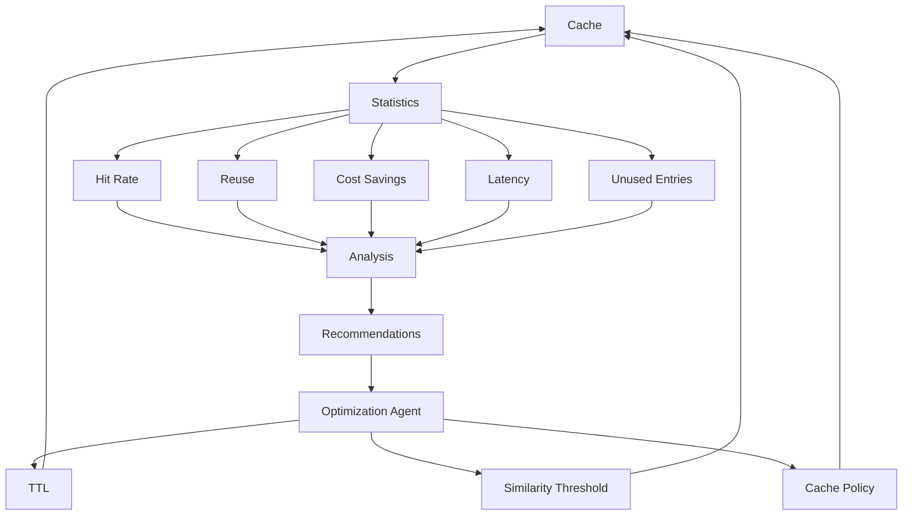


---

# 66. Optimization Feedback Loop

The complete system has several feedback loops.

```text
                   ┌─────────────────────┐
                   │     PRODUCTION      │
                   └──────────┬──────────┘
                              │
                              ▼
                       OBSERVABILITY
                              │
                              ▼
                         EVALUATION
                              │
          ┌───────────────────┼───────────────────┐
          ▼                   ▼                   ▼
       MODEL              RETRIEVAL            CACHE
          │                   │                   │
          └───────────────────┼───────────────────┘
                              ▼
                         OPTIMIZATION
                              │
                              ▼
                         DEPLOYMENT
                              │
                              ▼
                         PRODUCTION
```

---

# 67. Human Feedback Loop

```text
Agent
 ↓
Escalation
 ↓
Human Decision
 ↓
Approve / Correct / Reject
 ↓
Feedback Dataset
 ↓
Evaluation
 ↓
Policy / Workflow Improvement
```

---

# 68. Failure Taxonomy

Every failure should be classified.

```text
Model Failure
├── Hallucination
├── Wrong Reasoning
└── Unsupported Answer

Retrieval Failure
├── Missing Context
├── Wrong Context
├── Stale Context
└── Poor Ranking

Agent Failure
├── Wrong Plan
├── Wrong Tool
├── State Loss
└── Infinite Loop

Tool Failure
├── Timeout
├── Invalid Output
├── Permission
└── External Failure

Infrastructure Failure
├── Network
├── Compute
├── Storage
├── Dependency
└── Deployment

Security Failure
├── Injection
├── Leakage
├── Unauthorized Access
└── Tool Abuse
```

---

# 69. Reliability Strategy

```text
Detect
 ↓
Classify
 ↓
Recover
 ├── Retry
 ├── Replan
 ├── Reroute
 ├── Fallback
 └── Rollback
 ↓
Verify
 ↓
Continue
```

If automated recovery fails:

```text
Escalate → Human
```

---

# 70. Performance Strategy

Optimize in this order:

```text
1. Avoid unnecessary work
2. Cache repeated work
3. Parallelize independent work
4. Reduce context
5. Route to smaller models
6. Optimize inference
7. Scale infrastructure
```

Do not solve every latency problem by buying a larger GPU.

---

# 71. Cost Architecture

```text
Total AI Cost
│
├── Model Inference
├── Embeddings
├── Retrieval
├── Tool Calls
├── Browser / External Systems
├── Storage
├── Compute
├── Human Review
└── Observability
```

Cost should be attributed per:

```text
Tenant
Application
Workflow
Agent
Model
Tool
Request
```

---

# 72. Data Freshness

Every knowledge source should have:

```text
source_updated_at
indexed_at
version
expires_at
freshness_policy
```

Retrieval can then enforce:

```text
Latest
Recent
Historical
Version-Specific
```

---

# 73. Dynamic vs Static Knowledge

```text
Static
 ├── Product documentation
 ├── Policies
 └── Reference material
```


Dynamic
 ├── Inventory
 ├── Prices
 ├── Support status
 └── Live operational data

```

Static information is cache-friendly.

Dynamic information needs freshness controls.

---

# 74. Context Engineering

The objective is not:

```text
Maximum Context
```

It is:

```text
Maximum Useful Context
```

Pipeline:

```text
Retrieve
 ↓
Filter
 ↓
Rerank
 ↓
Compress
 ↓
Deduplicate
 ↓
Order
 ↓
Build Context
```

---

# 75. Context Budget

```text
Context Budget
├── System Instructions
├── User Query
├── Retrieved Knowledge
├── Memory
├── Tool Results
├── Agent State
└── Output Budget
```

The system should actively manage the context budget rather than stuffing everything into the model.

---

# 76. Model Routing

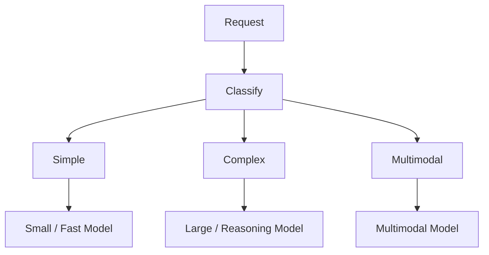


Routing decisions should consider:

```text
Quality
Latency
Cost
Risk
Context Size
Tool Requirements
```

---

# 77. Production Boundaries

A production architecture should have explicit boundaries.

```text
Trust Boundary
    ↓
Security Boundary
    ↓
Agent Boundary
    ↓
Tool Boundary
    ↓
Data Boundary
    ↓
Model Boundary
```

Every crossing should be:

```text
Authenticated
Authorized
Validated
Logged
Policy-checked
```

---

# 78. Minimum Production Requirements

## Agent

```text
✓ Durable state
✓ Checkpointing
✓ Planning
✓ Tool execution
✓ REACT loop
✓ Verification
✓ Retry
✓ Recovery
✓ Escalation
```

## Memory

```text
✓ Working memory
✓ Long-term memory
✓ User scoping
✓ Semantic retrieval
✓ Deduplication
```

## RAG

```text
✓ Structured ingestion
✓ Smart chunking
✓ Metadata
✓ Embeddings
✓ Hybrid search
✓ Metadata filtering
✓ Reranking
✓ Context construction
```

## Cache

```text
✓ Exact cache
✓ Semantic cache
✓ Model cache
✓ Tool cache
✓ Session cache
✓ TTL
✓ Invalidation
✓ Version-aware keys
```

## Reliability

```text
✓ Post-condition verification
✓ Guardrails
✓ Human escalation
✓ Failure recovery
✓ Rollback
```

## Operations

```text
✓ Logs
✓ Traces
✓ Metrics
✓ Evaluation
✓ Red teaming
✓ Cost tracking
✓ Deployment control
```

## Security

```text
✓ Authentication
✓ Authorization
✓ Tenant isolation
✓ ACL
✓ Encryption
✓ Secrets management
✓ DLP
✓ Audit
```

## Reproducibility

```text
✓ Versioned environment
✓ Versioned models
✓ Versioned prompts
✓ Versioned tools
✓ Versioned workflows
✓ Development / CI / staging / production consistency
```

---

# 79. Recommended Platform Abstractions

The implementation should be organized around stable interfaces.

```text
ModelProvider
EmbeddingProvider
Reranker
Retriever
VectorStore
MetadataStore
MemoryStore
CheckpointStore
Cache
Tool
ToolRegistry
Agent
Workflow
Policy
Evaluator
Tracer
HumanEscalation
```

The underlying vendor can change.

The platform contract should not.

---

# 80. Reference Platform Structure

```text
platform/
│
├── api/
│   ├── gateway/
│   ├── auth/
│   └── tenancy/
│
├── agents/
│   ├── runtime/
│   ├── planner/
│   ├── orchestrator/
│   ├── workflows/
│   └── state/
│
├── harness/
│   ├── plugins/
│   ├── lifecycle/
│   ├── dependencies/
│   ├── tools/
│   └── runtime/
│
├── memory/
│   ├── working/
│   ├── longterm/
│   └── checkpoints/
│
├── retrieval/
│   ├── vector/
│   ├── keyword/
│   ├── hybrid/
│   ├── reranking/
│   └── context/
│
├── knowledge/
│   ├── ingestion/
│   ├── parsing/
│   ├── chunking/
│   ├── metadata/
│   └── indexing/
│
├── cache/
│   ├── exact/
│   ├── semantic/
│   ├── model/
│   ├── tool/
│   └── session/
│
├── models/
│   ├── providers/
│   ├── routing/
│   └── prompts/
│
├── tools/
│   ├── registry/
│   ├── mcp/
│   ├── a2a/
│   └── execution/
│
├── safety/
│   ├── guardrails/
│   ├── validation/
│   ├── policies/
│   └── escalation/
│
├── evaluation/
│   ├── datasets/
│   ├── judges/
│   ├── regression/
│   └── experiments/
│
├── observability/
│   ├── logs/
│   ├── traces/
│   ├── metrics/
│   └── dashboards/
│
├── security/
│   ├── secrets/
│   ├── acl/
│   ├── dlp/
│   └── audit/
│
├── control-plane/
│   ├── config/
│   ├── registry/
│   ├── deployment/
│   ├── rollback/
│   └── feature-flags/
│
└── reproducibility/
    ├── environments/
    ├── versions/
    └── manifests/
```

---

# 81. Complete Runtime

```text
                           USER
                            │
                            ▼
                     API / APPLICATION
                            │
                            ▼
                   AUTH + AUTHORIZATION
                            │
                            ▼
                     TASK CLASSIFIER
                            │
                            ▼
                         PLANNER
                            │
                            ▼
                    AGENT ORCHESTRATOR
                            │
              ┌─────────────┼─────────────┐
              │             │             │
              ▼             ▼             ▼
           MEMORY         CACHE         TOOLS
              │             │             │
              │      ┌──────┴──────┐      │
              │      ▼             ▼      │
              │   EXACT        SEMANTIC   │
              │      │             │      │
              │      └──────┬──────┘      │
              │             │             │
              └─────────────┼─────────────┘
                            │
                            ▼
                      RETRIEVAL
                            │
               ┌────────────┼────────────┐
               ▼            ▼            ▼
             VECTOR      KEYWORD      FILTER
               │            │            │
               └────────────┼────────────┘
                            ▼
                          FUSION
                            │
                            ▼
                        RERANKING
                            │
                            ▼
                    CONTEXT CONSTRUCTION
                            │
                            ▼
                       MODEL ROUTER
                            │
                            ▼
                      MODEL SERVING
                            │
                            ▼
                        GENERATION
                            │
                            ▼
                       VERIFICATION
                            │
                 ┌──────────┼──────────┐
                 ▼          ▼          ▼
              PASS       RETRY      ESCALATE
                 │          │          │
                 │          │          ▼
                 │          │        HUMAN
                 │          │          │
                 │          └──────────┘
                 │
                 ▼
                 GUARDRAILS
                 │
                 ▼
             FINAL ANSWER
                 │
       ┌─────────┼─────────┐
       ▼         ▼         ▼
     TRACE     METRICS   EVAL
```

---

# 82. Complete Offline Pipeline

```text
                        DATA SOURCES
                             │
                             ▼
                         CONNECTORS
                             │
                             ▼
                           PARSER
                             │
                    ┌────────┴────────┐
                    ▼                 ▼
                  OCR              STRUCTURE
                    │                 │
                    └────────┬────────┘
                             ▼
                          CLEANING
                             │
                             ▼
                       DEDUPLICATION
                             │
                             ▼
                         VERSIONING
                             │
                             ▼
                           ACL
                             │
                             ▼
                      SMART CHUNKING
                             │
                             ▼
                        METADATA
                 ┌───────────┼───────────┐
                 ▼           ▼           ▼
              SUMMARY    KEYWORDS    QUESTIONS
                             │
                             ▼
                         EMBEDDING
                             │
            ┌────────────────┼─────────────────┐
            ▼                ▼                 ▼
       VECTOR STORE     SEARCH INDEX      GRAPH STORE
            │                │                 │
            └────────────────┼─────────────────┘
                             ▼
                         RETRIEVAL
                             │
                             ▼
                          EVAL
                             │
                             ▼
                       RE-INDEX / IMPROVE
```

---

# 83. Cross-Cutting Architecture

```text
                    ┌──────────────────────┐
                    │      SECURITY       │
                    └──────────────────────┘
                              │
                    ┌─────────▼─────────┐
                    │      GOVERNANCE   │
                    └─────────┬─────────┘
                              │
              ┌───────────────┼───────────────┐
              ▼               ▼               ▼
        AI STACK         AGENT RUNTIME    DATA PLANE
              │               │               │
              └───────────────┼───────────────┘
                              │
                    ┌─────────▼─────────┐
                    │   OBSERVABILITY   │
                    └─────────┬─────────┘
                              │
                    ┌─────────▼─────────┐
                    │    EVALUATION     │
                    └─────────┬─────────┘
                              │
                    ┌─────────▼─────────┐
                    │  RED TEAMING      │
                    └─────────┬─────────┘
                              │
                    ┌─────────▼─────────┐
                    │ REPRODUCIBILITY   │
                    └────────────────────┘
```

---

# 84. The Three Most Important Loops

## Agent loop

```text
Observe
 ↓
Reason
 ↓
Act
 ↓
Verify
 ↓
Repeat
```

## Reliability loop

```text
Detect
 ↓
Recover
 ↓
Verify
 ↓
Escalate if necessary
```

## Improvement loop

```text
Observe
 ↓
Evaluate
 ↓
Analyze
 ↓
Change
 ↓
Deploy
 ↓
Observe Again
```

---

# 85. The Correct Mental Model

```text
                       MODEL
                         │
              ┌──────────┴──────────┐
              │                     │
           THINKING              CONTEXT
              │                     │
              ▼                     ▼
        ORCHESTRATION           RETRIEVAL
              │                     │
              ├─────────┬───────────┤
              │         │
              ▼         ▼
            TOOLS     MEMORY
              │         │
              └────┬────┘
                   ▼
               EXECUTION
                   │
                   ▼
              VERIFICATION
                   │
          ┌────────┴────────┐
          ▼                 ▼
       APPROVE            ESCALATE
          │                 │
          └────────┬────────┘
                   ▼
                RESULT
```


Across everything:
Security
Observability
Evaluation
Governance
Reproducibility

```

---

# 86. Final Architecture Principle

```text
AI Platform
=
Compute
+
Models
+
Inference
+
Data
+
Retrieval
+
Memory
+
Caching
+
Tools
+
Protocols
+
Agents
+
Orchestration
+
Verification
+
Human Oversight
+
Security
+
Observability
+
Evaluation
+
Red Teaming
+
Reproducibility
+
Control Plane
```

The most important architectural conclusion across the supplied material is:

```text
              THE MODEL IS NOT THE SYSTEM

                      MODEL
                        │
                        ▼
               ┌────────────────┐
               │ Agent Runtime  │
               └───────┬────────┘
                       │
       ┌───────────────┼────────────────┐
       ▼               ▼                ▼
     Memory          Tools           Retrieval
       │               │                │
       └───────────────┼────────────────┘
                       ▼
                  Orchestration
                       │
                       ▼
                  Verification
                       │
                       ▼
              Human / Guardrails
                       │
                       ▼
                  Final Result

        + Security
        + Observability
        + Evaluation
        + Reproducibility
        + Governance
        + Control Plane
```

A model supplies intelligence. The surrounding system supplies **memory, context, tools, state, safety, recovery, measurement, and operational control**. That is why the supplied material repeatedly treats production reliability as an architecture problem rather than merely a model-selection problem. 

---

# 87. Final Production Checklist

```text
ARCHITECTURE
[ ] Layered architecture
[ ] Runtime / control-plane separation
[ ] Clear data boundaries
[ ] Clear security boundaries

MODELS
[ ] Model abstraction
[ ] Model routing
[ ] Model versioning
[ ] Prompt versioning
[ ] Fallback models

AGENTS
[ ] Planner
[ ] Orchestrator
[ ] Workflow engine
[ ] REACT loop
[ ] Durable state
[ ] Checkpointing
[ ] Recovery
[ ] Multi-agent support

HARNESS
[ ] Plugin architecture
[ ] Dependency resolver
[ ] Lifecycle manager
[ ] Safe teardown
[ ] Dynamic configuration
[ ] Interchangeable components

MEMORY
[ ] Working memory
[ ] Long-term memory
[ ] User scoping
[ ] Memory extraction
[ ] Deduplication
[ ] Semantic retrieval

RAG
[ ] Connectors
[ ] Parsing
[ ] OCR / Vision
[ ] Structure analysis
[ ] Chunking
[ ] Metadata
[ ] Embeddings
[ ] Hybrid search
[ ] Filtering
[ ] Reranking
[ ] Context construction

CACHE
[ ] Exact cache
[ ] Semantic cache
[ ] Model cache
[ ] Tool cache
[ ] Session cache
[ ] TTL
[ ] Invalidation
[ ] Versioned keys
[ ] Tenant isolation
[ ] Cache metrics

TOOLS
[ ] Tool registry
[ ] Tool schemas
[ ] Permissions
[ ] Timeouts
[ ] Retries
[ ] Budgets
[ ] MCP
[ ] A2A

RELIABILITY
[ ] Post-condition checks
[ ] Retry
[ ] Replan
[ ] Reroute
[ ] Fallback
[ ] Rollback
[ ] Safe stop

HUMAN OVERSIGHT
[ ] Confidence thresholds
[ ] Risk triggers
[ ] Business rules
[ ] Escalation queue
[ ] Context packaging
[ ] Human decision capture
[ ] Feedback loop

SECURITY
[ ] Authentication
[ ] Authorization
[ ] RBAC / ABAC
[ ] Tenant isolation
[ ] ACL-aware retrieval
[ ] Encryption
[ ] Secrets management
[ ] DLP
[ ] Audit logging
[ ] Prompt injection protection

OBSERVABILITY
[ ] Logs
[ ] Traces
[ ] Screenshots / artifacts
[ ] Metrics
[ ] Cost
[ ] Latency
[ ] Tool traces
[ ] Retrieval traces
[ ] Agent traces

EVALUATION
[ ] Golden dataset
[ ] Synthetic dataset
[ ] LLM judges
[ ] Precision
[ ] Recall
[ ] Faithfulness
[ ] Groundedness
[ ] Relevance
[ ] Completeness
[ ] Citation accuracy
[ ] Regression testing

RED TEAM
[ ] Prompt injection
[ ] Jailbreaks
[ ] Data leakage
[ ] Retrieval poisoning
[ ] Malicious documents
[ ] Tool abuse
[ ] Context manipulation
[ ] Bias / harm testing

REPRODUCIBILITY
[ ] Environment manifest
[ ] Runtime version
[ ] Python version
[ ] CUDA / driver version
[ ] Library versions
[ ] Model versions
[ ] Tool versions
[ ] MCP versions
[ ] Config versions
[ ] dev = CI = staging = prod

CONTROL PLANE
[ ] Configuration
[ ] Registries
[ ] Deployment
[ ] Versioning
[ ] Feature flags
[ ] Scaling
[ ] Rollback
[ ] Policy management

PRODUCTION
[ ] Backups
[ ] Disaster recovery
[ ] Health checks
[ ] Autoscaling
[ ] Capacity planning
[ ] Rate limiting
[ ] Quotas
[ ] Cost budgets
```

---

# 88. Final Mental Model

```text
                         APPLICATIONS
                              │
                              ▼
                    ORCHESTRATION / AGENTS
                              │
               ┌──────────────┼──────────────┐
               ▼              ▼              ▼
            MEMORY         RETRIEVAL        TOOLS
               │              │              │
               └──────────────┼──────────────┘
                              ▼
                         CACHE GATE
                              │
                              ▼
                       MODEL / INFERENCE
                              │
                              ▼
                         VERIFICATION
                              │
                    ┌─────────┴─────────┐
                    ▼                   ▼
                  HUMAN             GUARDRAILS
                    │                   │
                    └─────────┬─────────┘
                              ▼
                            OUTPUT


       KNOWLEDGE PLANE
       ───────────────
       Sources → Ingestion → Chunking → Metadata → Indexes


       CONTROL PLANE
       ─────────────
       Config → Version → Deploy → Observe → Evaluate → Rollback


       GOVERNANCE PLANE
       ─────────────────
       Security + Audit + Compliance + Cost + Policy


       RELIABILITY PLANE
       ─────────────────
       Verify + Retry + Recover + Escalate


       IMPROVEMENT PLANE
       ─────────────────
       Observe → Evaluate → Red Team → Optimize → Deploy