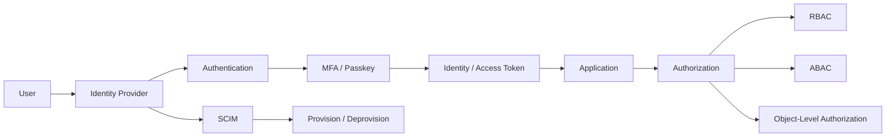
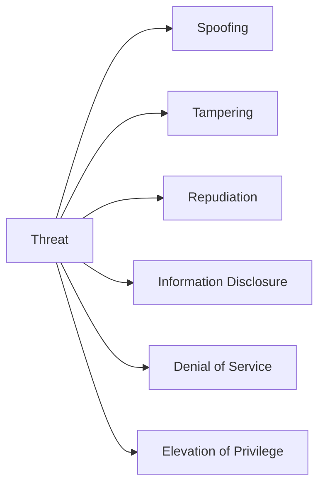
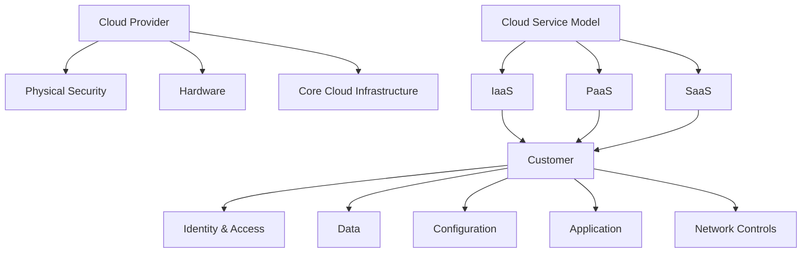
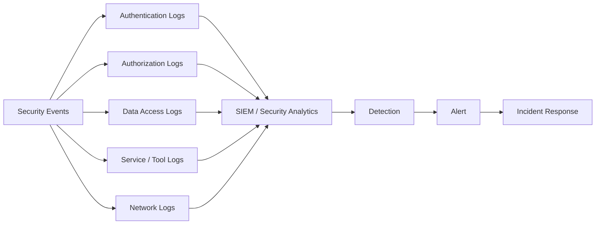
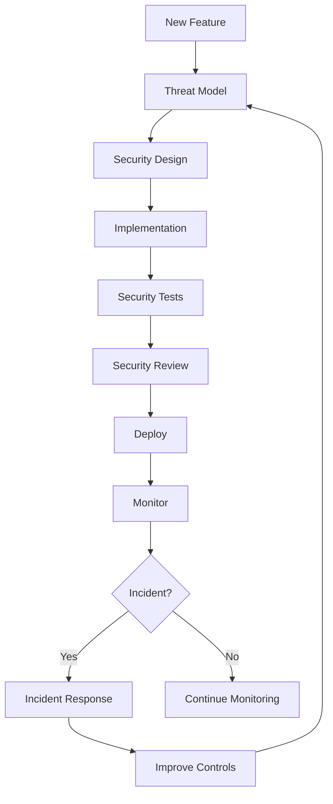

<!-- Security architecture · updated 2026-09-01 · status: active -->

# Production Security Architecture

> A production security system is not a collection of security features.
> It is an architecture that controls identity, access, data, execution,
> communication, infrastructure, and operational behavior from end to end.

---

# 1. Security Architecture Overview

The security model covered by this learning path can be organized into eight
major domains:

1. Identity
2. Authentication
3. Authorization
4. Application Security
5. Network & Transport Security
6. Data & Infrastructure Security
7. Threat Detection & Governance
8. Operational Security

These domains overlap. A production system should treat them as one security
boundary rather than isolated controls.

---

# 2. Master Security Architecture

```mermaid
flowchart TB

    %% ============================================================
    %% USERS
    %% ============================================================

    subgraph USERS["USERS & CLIENTS"]
        direction LR

        USER["User"]
        BROWSER["Browser"]
        MOBILE["Mobile App"]
        SERVICE["Service"]
        ADMIN["Administrator"]
        AGENT["AI Agent"]
    end

    %% ============================================================
    %% EDGE
    %% ============================================================

    subgraph EDGE["EDGE SECURITY"]
        direction LR

        DNS["DNS"]
        CDN["CDN"]
        WAF["WAF"]
        GATEWAY["API Gateway"]
        RATE["Rate Limiting"]
        DDOS["DDoS Protection"]

        DNS --> CDN
        CDN --> WAF
        WAF --> GATEWAY
        GATEWAY --> RATE
        RATE --> DDOS
    end

    %% ============================================================
    %% IDENTITY
    %% ============================================================

    subgraph IDENTITY["IDENTITY & ACCESS"]
        direction TB

        AUTHN["Authentication"]

        OAUTH["OAuth 2.0"]
        OIDC["OpenID Connect"]
        SAML["SAML"]
        MFA["MFA"]
        PASSKEY["Passkeys"]

        AUTHZ["Authorization"]

        RBAC["RBAC"]
        ABAC["ABAC"]
        BOLA["Object-Level Authorization"]

        IAM["Identity Provider / IAM"]
        SCIM["SCIM Provisioning"]

        AUTHN --> OAUTH
        AUTHN --> OIDC
        AUTHN --> SAML
        AUTHN --> MFA
        AUTHN --> PASSKEY

        IAM --> AUTHN
        IAM --> SCIM

        AUTHZ --> RBAC
        AUTHZ --> ABAC
        AUTHZ --> BOLA
    end

    %% ============================================================
    %% APPLICATION
    %% ============================================================

    subgraph APP["APPLICATION SECURITY"]
        direction TB

        APIAUTH["API Authentication"]

        JWT["JWT"]
        APIKEY["API Keys"]
        BASIC["Basic Auth"]

        BROWSERSEC["Browser Security"]

        CORS["CORS"]
        XSS["XSS Protection"]
        CSRF["CSRF Protection"]
        HEADERS["Security Headers"]

        INPUT["Input Validation"]
        OUTPUT["Output Validation"]

        SQLI["SQL Injection Protection"]

        SECRETS["Secrets Management"]

        APIAUTH --> JWT
        APIAUTH --> APIKEY
        APIAUTH --> BASIC

        BROWSERSEC --> CORS
        BROWSERSEC --> XSS
        BROWSERSEC --> CSRF
        BROWSERSEC --> HEADERS

        INPUT --> SQLI
        INPUT --> OUTPUT

        SECRETS --> INPUT
    end

    %% ============================================================
    %% SERVICE COMMUNICATION
    %% ============================================================

    subgraph NETWORK["NETWORK & SERVICE SECURITY"]
        direction LR

        TLS["TLS"]
        MTLS["mTLS"]
        PKI["PKI / Certificates"]

        ZT["Zero Trust"]
        SEG["Micro-Segmentation"]
        LEAST["Least Privilege"]

        SSH["SSH"]
        VPN["Private Connectivity"]

        TLS --> PKI
        MTLS --> PKI

        ZT --> SEG
        ZT --> LEAST
    end

    %% ============================================================
    %% DATA SECURITY
    %% ============================================================

    subgraph DATA["DATA SECURITY"]
        direction TB

        CLASSIFY["Data Classification"]

        ENCRYPT["Encryption"]

        ATREST["Encryption at Rest"]
        INTRANSIT["Encryption in Transit"]

        TOKEN["Tokenization"]

        HASH["Password Hashing"]

        DLP["DLP"]

        AUDIT["Data Access Audit"]

        CLASSIFY --> ENCRYPT
        ENCRYPT --> ATREST
        ENCRYPT --> INTRANSIT

        CLASSIFY --> DLP
        CLASSIFY --> AUDIT

        TOKEN --> ATREST
        HASH --> ATREST
    end

    %% ============================================================
    %% DATABASE / INFRASTRUCTURE
    %% ============================================================

    subgraph INFRA["INFRASTRUCTURE SECURITY"]
        direction LR

        DB["Databases"]
        CLOUD["Cloud"]
        ONPREM["On-Prem"]
        CONTAINER["Containers"]
        CI["CI / CD"]
        IAMINFRA["Infrastructure IAM"]
        IAC["Infrastructure as Code"]

        CLOUD --> IAMINFRA
        ONPREM --> IAMINFRA
        IAC --> CLOUD
        IAC --> ONPREM
        CI --> IAC
    end

    %% ============================================================
    %% THREAT MANAGEMENT
    %% ============================================================

    subgraph THREAT["THREAT MANAGEMENT"]
        direction TB

        STRIDE["STRIDE"]

        SPOOF["Spoofing"]
        TAMPER["Tampering"]
        REPUD["Repudiation"]
        DISCLOSE["Information Disclosure"]
        DOS["Denial of Service"]
        ELEVATE["Elevation of Privilege"]

        STRIDE --> SPOOF
        STRIDE --> TAMPER
        STRIDE --> REPUD
        STRIDE --> DISCLOSE
        STRIDE --> DOS
        STRIDE --> ELEVATE
    end

    %% ============================================================
    %% OPERATIONS
    %% ============================================================

    subgraph OPS["SECURITY OPERATIONS"]
        direction LR

        LOGS["Audit Logs"]
        MON["Monitoring"]
        ALERT["Alerting"]
        SIEM["SIEM"]
        INCIDENT["Incident Response"]
        FORENSICS["Forensics"]
        BACKUP["Backup / Recovery"]

        LOGS --> MON
        MON --> ALERT
        ALERT --> SIEM
        SIEM --> INCIDENT
        INCIDENT --> FORENSICS
        INCIDENT --> BACKUP
    end

    %% ============================================================
    %% GOVERNANCE
    %% ============================================================

    subgraph GOV["GOVERNANCE"]
        direction LR

        POLICY["Security Policies"]
        COMPLIANCE["Compliance"]
        RETENTION["Retention"]
        RISK["Risk Management"]
        REVIEW["Security Review"]

        POLICY --> COMPLIANCE
        POLICY --> RETENTION
        RISK --> REVIEW
    end

    %% ============================================================
    %% PRIMARY FLOW
    %% ============================================================

    USERS --> EDGE
    EDGE --> IDENTITY

    IDENTITY --> APP
    APP --> NETWORK

    NETWORK --> DATA
    DATA --> INFRA

    INFRA --> THREAT
    THREAT --> OPS
    OPS --> GOV

    %% ============================================================
    %% CROSS CONNECTIONS
    %% ============================================================

    BOLA --> DATA
    AUTHZ --> DATA

    AGENT --> AUTHZ
    AGENT --> APIAUTH

    MTLS --> SERVICE
    TLS --> BROWSER

    TOKEN --> DATA
    DLP --> OPS

    GOV -. governs .-> IDENTITY
    GOV -. governs .-> APP
    GOV -. governs .-> NETWORK
    GOV -. governs .-> DATA
    GOV -. governs .-> INFRA
    GOV -. governs .-> OPS

    %% ============================================================
    %% STYLING
    %% ============================================================

    classDef user fill:#1d2835,stroke:#7ea6d8,color:#fff,stroke-width:2px;
    classDef edge fill:#352a22,stroke:#d59a45,color:#fff,stroke-width:2px;
    classDef identity fill:#2d2440,stroke:#bb71e8,color:#fff,stroke-width:2px;
    classDef app fill:#263a2d,stroke:#72ba83,color:#fff,stroke-width:2px;
    classDef network fill:#20374a,stroke:#55b8e6,color:#fff,stroke-width:2px;
    classDef data fill:#3b2d40,stroke:#d46ee5,color:#fff,stroke-width:2px;
    classDef infra fill:#30332d,stroke:#a3b16d,color:#fff,stroke-width:2px;
    classDef threat fill:#452b2b,stroke:#e05a5a,color:#fff,stroke-width:2px;
    classDef ops fill:#2e3c3a,stroke:#6bc4b2,color:#fff,stroke-width:2px;
    classDef gov fill:#3a3525,stroke:#d7b65c,color:#fff,stroke-width:2px;

    class USER,BROWSER,MOBILE,SERVICE,ADMIN,AGENT user;
    class DNS,CDN,WAF,GATEWAY,RATE,DDOS edge;

    class AUTHN,OAUTH,OIDC,SAML,MFA,PASSKEY,AUTHZ,RBAC,ABAC,BOLA,IAM,SCIM identity;

    class APIAUTH,JWT,APIKEY,BASIC,BROWSERSEC,CORS,XSS,CSRF,HEADERS,INPUT,OUTPUT,SQLI,SECRETS app;

    class TLS,MTLS,PKI,ZT,SEG,LEAST,SSH,VPN network;

    class CLASSIFY,ENCRYPT,ATREST,INTRANSIT,TOKEN,HASH,DLP,AUDIT data;

    class DB,CLOUD,ONPREM,CONTAINER,CI,IAMINFRA,IAC infra;

    class STRIDE,SPOOF,TAMPER,REPUD,DISCLOSE,DOS,ELEVATE threat;

    class LOGS,MON,ALERT,SIEM,INCIDENT,FORENSICS,BACKUP ops;

    class POLICY,COMPLIANCE,RETENTION,RISK,REVIEW gov;
````

---

# 3. Security Architecture Layers

```text
                    SECURITY ARCHITECTURE

┌──────────────────────────────────────────────────────┐
│                 APPLICATION SECURITY                 │
│ CORS │ XSS │ CSRF │ SQLi │ API Security │ Headers  │
└───────────────────────────┬──────────────────────────┘
                            │
┌───────────────────────────▼──────────────────────────┐
│                  IDENTITY & ACCESS                   │
│ OAuth2 │ OIDC │ SAML │ MFA │ RBAC │ ABAC │ BOLA     │
└───────────────────────────┬──────────────────────────┘
                            │
┌───────────────────────────▼──────────────────────────┐
│                NETWORK & TRANSPORT                   │
│ TLS │ mTLS │ PKI │ SSH │ Zero Trust │ Segmentation  │
└───────────────────────────┬──────────────────────────┘
                            │
┌───────────────────────────▼──────────────────────────┐
│                     DATA                             │
│ Encryption │ Hashing │ Tokenization │ DLP │ Audit   │
└───────────────────────────┬──────────────────────────┘
                            │
┌───────────────────────────▼──────────────────────────┐
│                 INFRASTRUCTURE                       │
│ Cloud │ On-Prem │ CI/CD │ IaC │ IAM │ Databases     │
└──────────────────────────────────────────────────────┘

CROSS-CUTTING
────────────────────────────────────────────────────────
Governance │ Logging │ Monitoring │ Incident Response
Threat Modeling │ Compliance │ Risk Management
```

---

# 4. Identity Architecture

The security foundation is identity.



Core separation:

```text
Authentication
    =
Who are you?

Authorization
    =
What are you allowed to do?
```

The playlist repeatedly reinforces this distinction through OAuth/OIDC, JWT,
RBAC/ABAC, IDOR/BOLA, and Zero Trust.

---

# 5. OAuth 2.0

OAuth 2.0 is an authorization framework.

```text
Resource Owner
      │
      ▼
Authorization Server
      │
      ▼
Authorization Code
      │
      ▼
Client
      │
      ▼
Access Token
      │
      ▼
Resource Server
```

Core concepts:

```text
Resource Owner
Client
Authorization Server
Resource Server
Access Token
Scope
Authorization Code
PKCE
```

The indexed playlist summary recommends Authorization Code + PKCE for modern
web/mobile clients. ([INFORMATION IS WEALTH][2])

---

# 6. OpenID Connect

OIDC adds identity on top of OAuth 2.0.

```text
OAuth 2.0
    ↓
Authorization

OIDC
    ↓
Authentication / Identity
```

Typical flow:

```text
User
 ↓
Client
 ↓
Identity Provider
 ↓
Authorization
 ↓
Code
 ↓
Token Endpoint
 ↓
ID Token + Access Token
```

---

# 7. SAML

SAML is enterprise federation.

```text
User
 ↓
Service Provider
 ↓
Identity Provider
 ↓
Authentication
 ↓
Signed Assertion
 ↓
Service Provider
```

Main components:

```text
Identity Provider
Service Provider
SAML Assertion
Metadata
Certificates
Trust Relationship
```

Use cases commonly include enterprise SSO.

---

# 8. SSO + OIDC + SCIM

The complete enterprise identity lifecycle is:

```text
Employee joins
      ↓
SCIM Provisioning
      ↓
Account created
      ↓
OIDC / SAML Login
      ↓
Application Access
      ↓
RBAC / ABAC
      ↓
Employee leaves
      ↓
SCIM Deprovisioning
```

This is much stronger than treating login as the entire identity system.

---

# 9. API Authentication

Compare:

```text
Basic Auth
API Keys
JWT
OAuth 2.0
mTLS
```

Recommended conceptual hierarchy:

```text
Simple / legacy
    ↓
API Key

Stateless application identity
    ↓
JWT

Delegated authorization
    ↓
OAuth 2.0

Identity
    ↓
OIDC

Service-to-service identity
    ↓
mTLS
```

The playlist's API-auth material explicitly compares Basic Auth, API keys, and
JWTs. ([INFORMATION IS WEALTH][2])

---

# 10. JWT

JWT consists of:

```text
Header
Payload
Signature
```

```text
JWT
│
├── Header
├── Payload
└── Signature
```

Important rule:

```text
Base64URL encoding
≠
Encryption
```

Do not put secrets or passwords in the payload.

JWT should be:

```text
Signed
Short-lived
Scoped
Validated
Version-aware
```

The playlist summary emphasizes the three-part structure, statelessness, and
signature validation. ([INFORMATION IS WEALTH][2])

---

# 11. RBAC vs ABAC

## RBAC

```text
User
 ↓
Role
 ↓
Permissions
```

Example:

```text
Admin
 ├── read
 ├── write
 └── delete
```

## ABAC

```text
User
+
Resource
+
Environment
+
Context
 ↓
Policy Decision
```

Example:

```text
Allow

IF
user.department == "finance"
AND
resource.classification == "internal"
AND
device.managed == true
```

The playlist describes RBAC as simpler and ABAC as useful for dynamic,
fine-grained policy decisions. ([INFORMATION IS WEALTH][2])

Best production pattern:

```text
RBAC
 +
ABAC
```

---

# 12. Object-Level Authorization

Authentication is not enough.

```text
User is authenticated
        ↓
User requests /users/102
        ↓
Is User 102 allowed?
        ↓
YES / NO
```

This prevents:

```text
IDOR
BOLA
```

The playlist maps these as authorization failures where a user manipulates an
object identifier to access another user's data. ([INFORMATION IS WEALTH][2])

---

# 13. Spring Security

The Spring Security mental model is a filter chain.

```text
HTTP Request
     ↓
Security Filter Chain
     ↓
Authentication
     ↓
Authentication Provider
     ↓
Security Context
     ↓
Authorization
     ↓
Controller
```

Core components:

```text
DelegatingFilterProxy
AuthenticationManager
AuthenticationProvider
UserDetailsService
SecurityContext
SecurityContextHolder
```

The playlist summary specifically frames Spring Security around the filter
chain and these components. ([INFORMATION IS WEALTH][2])

---

# 14. Browser Security

```text
Browser Security
├── Same-Origin Policy
├── CORS
├── XSS
├── CSRF
└── Security Headers
```

---

# 15. CORS

CORS controls which origins are allowed to access browser resources.

```text
Browser
   │
   ▼
Cross-Origin Request
   │
   ▼
Preflight OPTIONS
   │
   ▼
Server Policy
   │
   ├── Allow
   └── Deny
```

Important headers include:

```text
Access-Control-Allow-Origin
Access-Control-Allow-Methods
Access-Control-Allow-Headers
```

Do not blindly configure:

```text
Access-Control-Allow-Origin: *
```

for credentialed or sensitive production applications.

The playlist specifically covers origins, preflight requests, and CORS headers. ([INFORMATION IS WEALTH][2])

---

# 16. XSS

XSS means malicious script reaches a user's browser.

Three major forms:

```text
Stored XSS
Reflected XSS
DOM-Based XSS
```

Defense:

```text
Input Validation
Output Encoding
Context-Aware Escaping
Content Security Policy
Safe Framework Defaults
```

Never treat user-controlled data as trusted executable content.

The playlist's XSS material covers stored, reflected, and DOM-based XSS and their
impact on sessions and data. ([INFORMATION IS WEALTH][2])

---

# 17. CSRF

CSRF exploits ambient browser authentication.

```text
Victim Logged In
       ↓
Malicious Site
       ↓
Forged Request
       ↓
Browser Sends Credentials
       ↓
Target Application
```

Defenses:

```text
CSRF Tokens
SameSite Cookies
Origin Checking
Properly Designed APIs
```

The playlist specifically explains CSRF around cookies, forged requests, CSRF
tokens, and SameSite cookies. ([INFORMATION IS WEALTH][2])

---

# 18. SQL Injection

The root mistake is mixing:

```text
Data
+
Code
```

Unsafe:

```text
SQL = "SELECT ... WHERE name = '" + user_input + "'"
```

Safe:

```text
Parameterized Query
```

Defense stack:

```text
Prepared Statements
Parameterized Queries
ORM Safe APIs
Input Validation
Least Privileged DB Accounts
Database Monitoring
```

The playlist identifies prepared statements / parameterized queries as the
primary defense. ([INFORMATION IS WEALTH][2])

---

# 19. Security Headers

Important browser controls include:

```text
Content-Security-Policy
Strict-Transport-Security
X-Frame-Options
X-Content-Type-Options
```

Conceptually:

```text
Application
     ↓
HTTP Response Headers
     ↓
Browser Security Policy
```

Headers are a defense layer, not a replacement for secure application logic.

---

# 20. Transport Security

```text
HTTP
 ↓
TLS
 ↓
HTTPS
```

TLS provides:

```text
Confidentiality
Integrity
Authentication
```

The playlist covers symmetric/asymmetric cryptography, certificates, TLS 1.3,
certificate authorities, and forward secrecy. ([INFORMATION IS WEALTH][2])

---

# 21. mTLS

Standard TLS:

```text
Client
   │
   └── verifies Server
```

mTLS:

```text
Client
   │
   ├── verifies Server
   │
   └── proves Client Identity
```

Use mTLS for high-trust service-to-service communication.

Components:

```text
PKI
Certificate Authority
Client Certificates
Server Certificates
Rotation
Revocation
Service Identity
```

The playlist covers mTLS, X.509 certificates, certificate rotation, and service
mesh integration. ([INFORMATION IS WEALTH][2])

---

# 22. Zero Trust

The security posture is:

```text
Never Trust
Always Verify
```

Architecture:

```text
Identity
 ↓
Authentication
 ↓
Authorization
 ↓
Least Privilege
 ↓
Micro-Segmentation
 ↓
Continuous Verification
```

The network is no longer the trust boundary.

Identity and policy are.

The playlist frames Zero Trust around the perimeter myth, segmentation,
least privilege, and identity-centric security. ([INFORMATION IS WEALTH][2])

---

# 23. Rate Limiting

Rate limiting protects:

```text
Availability
Cost
Authentication
APIs
Infrastructure
```

Algorithms:

```text
Fixed Window
Sliding Window
Token Bucket
Leaky Bucket
```

Distributed architecture:

```text
Server A ─┐
Server B ─┼──► Shared Rate Limit State
Server C ─┘
```

The playlist specifically includes token bucket, leaky bucket, fixed-window
strategies, and distributed rate limiting. ([INFORMATION IS WEALTH][2])

---

# 24. Payments Security

Payment architecture:

```text
Customer
   ↓
Merchant
   ↓
Payment Gateway
   ↓
Payment Processor
   ↓
Networks / Banks
```

Security concepts:

```text
Tokenization
Encryption
PCI DSS
Fraud Detection
3-D Secure
Authorization
Audit
```

Never unnecessarily store raw payment credentials.

---

# 25. Password Storage

Passwords should not be encrypted for later recovery.

They should be hashed.

```text
Password
   ↓
Salt
   ↓
Password Hash Function
   ↓
Stored Hash
```

Modern approach:

```text
Argon2
bcrypt
scrypt
```

Additional control:

```text
Pepper
```

Do not invent your own password hashing algorithm.

The playlist explicitly covers hashing vs encryption, salting, adaptive hashing,
peppering, and password security. ([INFORMATION IS WEALTH][2])

---

# 26. SSH Security

Secure server access:

```text
User
 ↓
SSH
 ↓
Public / Private Key
 ↓
Server
```

Hardening:

```text
Disable Root Login
Disable Password Authentication
Use SSH Keys
Use Short / Controlled Access
Restrict Network Exposure
Monitor Login Attempts
Fail2Ban / Equivalent Controls
```

The playlist includes key-based authentication, tunneling, SSH hardening and
brute-force protection. ([INFORMATION IS WEALTH][2])

---

# 27. Insider Risk

Security threats do not always come from outside.

```text
Insider Risk
├── Malicious Insider
├── Compromised Employee
├── Accidental Exposure
└── Shadow IT
```

Controls:

```text
Least Privilege
DLP
Audit Logging
Behavior Analytics
Anomaly Detection
Data Classification
Access Reviews
Secret Scanning
```

The playlist specifically connects insider risk with DLP, UBA, least privilege,
and shadow IT. ([INFORMATION IS WEALTH][2])

---

# 28. Security Misconfiguration

Typical failures:

```text
Default Credentials
Debug Mode
Verbose Errors
Open Admin Consoles
Public API Docs
Directory Listing
Unused Ports
Forgotten Test Systems
```

Hardening principle:

```text
Default
 ↓
Remove Everything Unnecessary
 ↓
Explicitly Allow What Is Needed
```

The playlist's misconfiguration topic specifically covers defaults, verbose
errors, public consoles/docs, and directory listings. ([INFORMATION IS WEALTH][2])

---

# 29. Threat Modeling with STRIDE



Mapping:

| STRIDE                 | Security Goal            |
| ---------------------- | ------------------------ |
| Spoofing               | Authentication           |
| Tampering              | Integrity                |
| Repudiation            | Logging / Accountability |
| Information Disclosure | Confidentiality          |
| Denial of Service      | Availability             |
| Elevation of Privilege | Authorization            |

The playlist explicitly presents these six STRIDE categories and their
corresponding defenses. ([INFORMATION IS WEALTH][2])

---

# 30. Cloud Security

Cloud security is shared responsibility.

```text
Cloud Provider
├── Physical Infrastructure
├── Hardware
├── Core Platform
└── Managed Service Infrastructure

Customer
├── IAM
├── Data
├── Application
├── Configuration
├── Network Rules
└── OS / Runtime where applicable
```

The boundary changes depending on:

```text
IaaS
PaaS
SaaS
```

The playlist emphasizes that using a secure cloud provider does not make an
insecure customer configuration safe. ([INFORMATION IS WEALTH][2])

---

# 31. Secure Cloud Model



---

# 32. Security Control Plane

Security should operate across the entire application.

```text
                   SECURITY CONTROL PLANE

┌──────────────────────────────────────────────────────────┐
│ Identity                                                │
│ Authentication / Authorization / IAM                   │
├──────────────────────────────────────────────────────────┤
│ Data                                                   │
│ Encryption / DLP / Classification / Tokenization       │
├──────────────────────────────────────────────────────────┤
│ Application                                            │
│ Validation / XSS / CSRF / SQLi / CORS                  │
├──────────────────────────────────────────────────────────┤
│ Network                                               │
│ TLS / mTLS / Zero Trust / Segmentation                 │
├──────────────────────────────────────────────────────────┤
│ Infrastructure                                         │
│ Cloud / SSH / CI / IAM / Hardening                    │
├──────────────────────────────────────────────────────────┤
│ Operations                                             │
│ Logs / Monitoring / Alerts / Incident Response         │
├──────────────────────────────────────────────────────────┤
│ Governance                                             │
│ Risk / Compliance / Policies / Reviews                │
└──────────────────────────────────────────────────────────┘
```

---

# 33. Secure Request Lifecycle

```text
Request
  ↓
DNS / CDN
  ↓
WAF
  ↓
API Gateway
  ↓
Rate Limiting
  ↓
Authentication
  ↓
Authorization
  ↓
Tenant / Object Permission
  ↓
Input Validation
  ↓
Business Logic
  ↓
Database / Service Calls
  ↓
Output Validation
  ↓
Audit Logging
  ↓
Response
```

Every important boundary should have an explicit security decision.

---

# 34. Secure Service-to-Service Lifecycle

```text
Service A
   ↓
Identity
   ↓
mTLS
   ↓
Authorization
   ↓
Least Privilege
   ↓
Service B
   ↓
Audit
```

---

# 35. Secure Data Lifecycle

```text
Collect
  ↓
Classify
  ↓
Authorize
  ↓
Encrypt
  ↓
Store
  ↓
Access
  ↓
Monitor
  ↓
Audit
  ↓
Retain / Delete
```

---

# 36. Identity Lifecycle

```text
Create
 ↓
Authenticate
 ↓
Authorize
 ↓
Provision
 ↓
Use
 ↓
Monitor
 ↓
Review
 ↓
Revoke
 ↓
Delete
```

SCIM belongs primarily in the provisioning/deprovisioning part of this
lifecycle. ([INFORMATION IS WEALTH][2])

---

# 37. Security Monitoring



---

# 38. What Must Be Logged

At minimum:

```text
Who
What
When
Where
Why
Result
Resource
IP / Network Context
Authentication Method
Authorization Decision
```

For high-risk operations also record:

```text
Before State
Action
After State
Approval
Execution ID
Correlation ID
```

---

# 39. Security Review Workflow



---

# 40. Security Testing Pyramid

```text
                     ┌──────────────┐
                     │ Pen Testing  │
                     └──────────────┘
                           ▲
                     ┌──────────────┐
                     │ Threat Model │
                     └──────────────┘
                           ▲
                     ┌──────────────┐
                     │ DAST / IAST  │
                     └──────────────┘
                           ▲
                     ┌──────────────┐
                     │ SAST / SCA   │
                     └──────────────┘
                           ▲
                     ┌──────────────┐
                     │ Unit / Tests │
                     └──────────────┘
```

---

# 41. Production Security Checklist

## Identity

```text
[ ] Central identity provider
[ ] Strong authentication
[ ] MFA
[ ] Passkeys where appropriate
[ ] OAuth2
[ ] OIDC
[ ] SAML for enterprise federation
[ ] SCIM provisioning
[ ] Session management
```

## Authorization

```text
[ ] RBAC
[ ] ABAC where required
[ ] Object-level authorization
[ ] Tenant isolation
[ ] Least privilege
[ ] Default deny
```

## API

```text
[ ] TLS
[ ] Authentication
[ ] Authorization
[ ] Input validation
[ ] Output validation
[ ] Rate limiting
[ ] Request size limits
[ ] Timeouts
[ ] Audit logging
```

## Browser

```text
[ ] CORS
[ ] CSRF protection
[ ] XSS protection
[ ] CSP
[ ] HSTS
[ ] Clickjacking protection
[ ] Secure cookies
```

## Database

```text
[ ] Parameterized queries
[ ] Least privilege DB users
[ ] Encryption at rest
[ ] Backups
[ ] Audit logging
[ ] Secret rotation
```

## Network

```text
[ ] TLS
[ ] mTLS where appropriate
[ ] PKI
[ ] Certificate rotation
[ ] Network segmentation
[ ] Zero Trust
[ ] Private connectivity
```

## Infrastructure

```text
[ ] SSH key authentication
[ ] No unnecessary public services
[ ] Hardened images
[ ] Secure CI/CD
[ ] Infrastructure as Code
[ ] Cloud IAM
[ ] Configuration management
[ ] Drift detection
```

## Data

```text
[ ] Classification
[ ] Encryption
[ ] Tokenization
[ ] DLP
[ ] Retention
[ ] Access reviews
[ ] Data deletion
```

## Operations

```text
[ ] Centralized logs
[ ] SIEM / security analytics
[ ] Alerting
[ ] Incident response
[ ] Forensics
[ ] Backups
[ ] Disaster recovery
```

---

# 42. Security Failure Model

Every system should ask:

```text
What if authentication fails?

What if authorization is bypassed?

What if a token is stolen?

What if a session expires?

What if the database is exposed?

What if the network is compromised?

What if an employee leaks data?

What if a service is impersonated?

What if an API is flooded?

What if a configuration changes?

What if secrets leak?

What if an attacker is already inside?
```

Then design:

```text
Prevent
 ↓
Detect
 ↓
Contain
 ↓
Recover
 ↓
Learn
```

---

# 43. Defense in Depth

Never rely on one control.

Example:

```text
Password
 ↓
MFA
 ↓
Session Security
 ↓
RBAC
 ↓
Object-Level Authorization
 ↓
Network Controls
 ↓
Database Permissions
 ↓
Audit
```

Another example:

```text
SQL Injection
 ↓
Parameterized Query
 ↓
Input Validation
 ↓
Least-Privilege DB User
 ↓
Monitoring
 ↓
Database Firewall
```

If one layer fails, another should still limit the damage.

---

# 44. Zero-Trust Security Model

```text
            ZERO TRUST

           ┌───────────┐
           │ Identity  │
           └─────┬─────┘
                 ↓
           ┌───────────┐
           │ Verify    │
           └─────┬─────┘
                 ↓
           ┌───────────┐
           │ Policy    │
           └─────┬─────┘
                 ↓
           ┌───────────┐
           │ Least     │
           │ Privilege │
           └─────┬─────┘
                 ↓
           ┌───────────┐
           │ Resource  │
           └─────┬─────┘
                 ↓
           ┌───────────┐
           │ Audit     │
           └───────────┘
```

---

# 45. Security Architecture by Trust Boundary

```text
PUBLIC INTERNET
       │
       ▼
EDGE / WAF
       │
       ▼
API GATEWAY
       │
       ▼
AUTHENTICATION
       │
       ▼
AUTHORIZATION
       │
       ▼
APPLICATION
       │
       ├──────────► DATABASE
       │
       ├──────────► INTERNAL SERVICE
       │
       └──────────► EXTERNAL SERVICE
```

Each arrow is a potential attack surface.

---

# 46. Security Architecture for AI Systems

For an AI-enabled application, extend the model:

```text
User
 ↓
Identity
 ↓
Authorization
 ↓
Prompt Boundary
 ↓
AI Application
 ↓
Retrieval
 ↓
Memory
 ↓
Tools
 ↓
Model
 ↓
Output Validation
 ↓
DLP
 ↓
Audit
```

Additional AI-specific controls:

```text
Prompt Injection Defense
Tool Permissions
Memory Isolation
Retrieved-Data ACLs
Output Guardrails
Model Access Controls
AI Audit Logs
Cost Controls
Agent Action Policies
```

This connects the security basics from this playlist to the AI/RAG/agent
architecture developed earlier.

---

# 47. Security + RAG

The security boundary must exist before retrieval.

```text
User
 ↓
Identity
 ↓
Authorization
 ↓
Tenant
 ↓
Document ACL
 ↓
Metadata Filtering
 ↓
Vector / Keyword Search
 ↓
Reranking
 ↓
Authorized Context
 ↓
LLM
```

Never:

```text
Vector Search
 ↓
Then decide permissions
```

Permissions should constrain retrieval itself.

---

# 48. Security + Agents

An agent should never receive unrestricted authority.

```text
Agent
 │
 ├── Tool Permission
 ├── Data Permission
 ├── Action Permission
 ├── Budget
 ├── Rate Limit
 ├── Risk Policy
 └── Human Approval
```

High-risk actions:

```text
Payment
Delete
Send
Publish
Deploy
Change Permission
Export Data
```

should have stronger controls.

---

# 49. Security + Caching

A cache hit is not automatically safe.

```text
User
 ↓
Authorization
 ↓
Cache Lookup
 ↓
Tenant Check
 ↓
Permission Check
 ↓
Freshness Check
 ↓
Return Cached Result
```

Cache keys should include the security-relevant context where necessary:

```text
tenant
user / principal
resource scope
authorization context
data version
model / prompt version
request
```

---

# 50. Final Production Security Architecture

```text
                              USERS
                                │
                                ▼
                    ┌────────────────────┐
                    │ EDGE / API GATEWAY │
                    │ WAF / Rate Limits  │
                    └──────────┬─────────┘
                               │
                               ▼
                    ┌────────────────────┐
                    │ IDENTITY           │
                    │ OAuth2 / OIDC      │
                    │ SAML / MFA / SCIM  │
                    └──────────┬─────────┘
                               │
                               ▼
                    ┌────────────────────┐
                    │ AUTHORIZATION      │
                    │ RBAC / ABAC / BOLA │
                    └──────────┬─────────┘
                               │
                               ▼
                    ┌────────────────────┐
                    │ APPLICATION        │
                    │ Validation         │
                    │ CORS / XSS / CSRF  │
                    │ SQLi Protection    │
                    └──────────┬─────────┘
                               │
             ┌─────────────────┼─────────────────┐
             ▼                 ▼                 ▼
        ┌───────────┐   ┌────────────┐    ┌─────────────┐
        │   DATA    │   │  NETWORK   │    │    AGENT    │
        │           │   │            │    │             │
        │ Encryption│   │ TLS / mTLS │    │ Tools       │
        │ DLP       │   │ Zero Trust │    │ Memory      │
        │ Tokenize  │   │ PKI        │    │ Actions     │
        └─────┬─────┘   └──────┬─────┘    └──────┬──────┘
              │                │                  │
              └────────────────┼──────────────────┘
                               ▼
                    ┌────────────────────┐
                    │ INFRASTRUCTURE     │
                    │ Cloud / On-Prem    │
                    │ DB / CI / SSH / IaC│
                    └──────────┬─────────┘
                               │
                               ▼
                    ┌────────────────────┐
                    │ DETECTION          │
                    │ Logs / SIEM / UBA  │
                    │ Alerts / DLP       │
                    └──────────┬─────────┘
                               │
                               ▼
                    ┌────────────────────┐
                    │ RESPONSE           │
                    │ Contain / Recover  │
                    │ Investigate        │
                    └──────────┬─────────┘
                               │
                               ▼
                    ┌────────────────────┐
                    │ GOVERNANCE         │
                    │ Risk / Compliance  │
                    │ Policy / Review    │
                    └────────────────────┘
```

---

# 51. Complete Security Mental Model

```text
SECURITY

├── IDENTITY
│   ├── Authentication
│   ├── OAuth2
│   ├── OIDC
│   ├── SAML
│   ├── MFA
│   ├── Passkeys
│   └── SCIM
│
├── AUTHORIZATION
│   ├── RBAC
│   ├── ABAC
│   ├── Least Privilege
│   └── Object-Level Authorization
│
├── APPLICATION
│   ├── API Security
│   ├── JWT
│   ├── CORS
│   ├── XSS
│   ├── CSRF
│   ├── SQL Injection
│   └── Security Headers
│
├── NETWORK
│   ├── HTTPS
│   ├── TLS
│   ├── mTLS
│   ├── PKI
│   ├── Zero Trust
│   ├── Segmentation
│   └── SSH
│
├── DATA
│   ├── Encryption
│   ├── Hashing
│   ├── Tokenization
│   ├── DLP
│   └── Classification
│
├── INFRASTRUCTURE
│   ├── Cloud
│   ├── On-Prem
│   ├── IAM
│   ├── CI/CD
│   ├── IaC
│   └── Hardening
│
├── THREAT MANAGEMENT
│   ├── STRIDE
│   ├── Insider Risk
│   ├── Data Exfiltration
│   ├── Misconfiguration
│   └── Attack Detection
│
└── OPERATIONS
    ├── Logging
    ├── Monitoring
    ├── SIEM
    ├── Incident Response
    ├── Recovery
    └── Governance
```

---

# 52. Playlist Coverage Map

| Video                           | Security Domain             |
| ------------------------------- | --------------------------- |
| 1. OAuth 2.0                    | Identity / Authorization    |
| 2. SAML                         | Enterprise Federation       |
| 3. SSO / OIDC / SCIM            | Identity Lifecycle          |
| 4. API Authentication           | API Security                |
| 5. RBAC vs ABAC                 | Authorization               |
| 6. Spring Security              | Application IAM             |
| 7. mTLS                         | Service Security            |
| 8. Payment Gateway vs Processor | Payment Security            |
| 9. JWT                          | Token Security              |
| 10. CORS                        | Browser Security            |
| 11. XSS                         | Application Security        |
| 12. CSRF                        | Web Security                |
| 13. SQL Injection               | Database Security           |
| 14. Secure Headers              | Browser / HTTP Security     |
| 15. Zero Trust                  | Architecture                |
| 16. Rate Limiting               | Availability / API Security |
| 17. OAuth2 & OIDC               | Identity                    |
| 18. IDOR / BOLA                 | Authorization               |
| 19. Security Misconfiguration   | Infrastructure Security     |
| 20. mTLS                        | Service Security            |
| 21. Insider Risk                | Data Security               |
| 22. Password Storage            | Credential Security         |
| 23. HTTPS / TLS                 | Transport Security          |
| 24. SSH                         | Infrastructure Security     |
| 25. STRIDE                      | Threat Modeling             |
| 26. Cloud Shared Responsibility | Cloud Security              |

This mapping follows the indexed playlist summary. ([INFORMATION IS WEALTH][2])

---

# 53. What a Production System Must Ultimately Enforce

```text
WHO
 ↓
Authentication

WHAT
 ↓
Authorization

WHICH DATA
 ↓
Data Access Policy

WHICH ACTION
 ↓
Action Policy

WHERE
 ↓
Network / Device / Environment Policy

HOW
 ↓
Secure Protocols

WHEN
 ↓
Session / Time / Freshness Policy

WHY
 ↓
Business / Risk Policy

WHAT HAPPENED
 ↓
Audit / Observability

WHAT IF IT FAILS
 ↓
Detection / Response / Recovery
```

---

# 54. The One Rule Behind the Entire Architecture

```text
NEVER TRUST THE INPUT.
NEVER ASSUME THE CALLER IS SAFE.
NEVER ASSUME THE NETWORK IS SAFE.
NEVER ASSUME THE USER IS AUTHORIZED.
NEVER ASSUME THE DATA IS SAFE.
NEVER ASSUME THE CONFIGURATION IS CORRECT.
NEVER ASSUME THE SYSTEM SUCCEEDED.
```

Instead:

```text
Authenticate
Verify
Authorize
Validate
Constrain
Encrypt
Monitor
Audit
Recover
```

---

# 55. Final Definition

A production security architecture is:

```text
Identity
+
Authentication
+
Authorization
+
Application Security
+
Network Security
+
Data Security
+
Infrastructure Security
+
Threat Modeling
+
Detection
+
Observability
+
Governance
+
Incident Response
+
Recovery
```

And for an AI-native system:

```text
Security
+
RAG Security
+
Memory Security
+
Tool Security
+
Agent Security
+
Prompt-Injection Defense
+
Data Leakage Prevention
+
Agent Action Controls
```

The playlist's material establishes the traditional security foundation; the
AI-specific additions above extend that foundation to the agent/RAG systems
from the architectures we built earlier. The core source themes include
authentication and authorization, web/API security, transport security,
Zero Trust, threat modeling, insider risk, and cloud responsibility. ([INFORMATION IS WEALTH][2])

